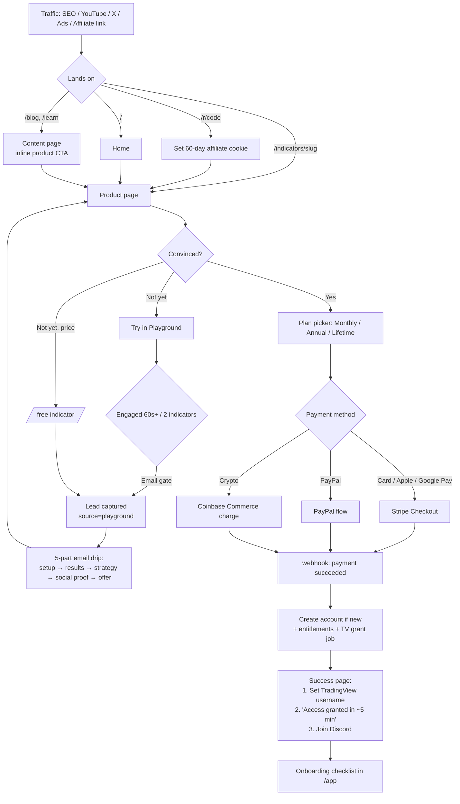
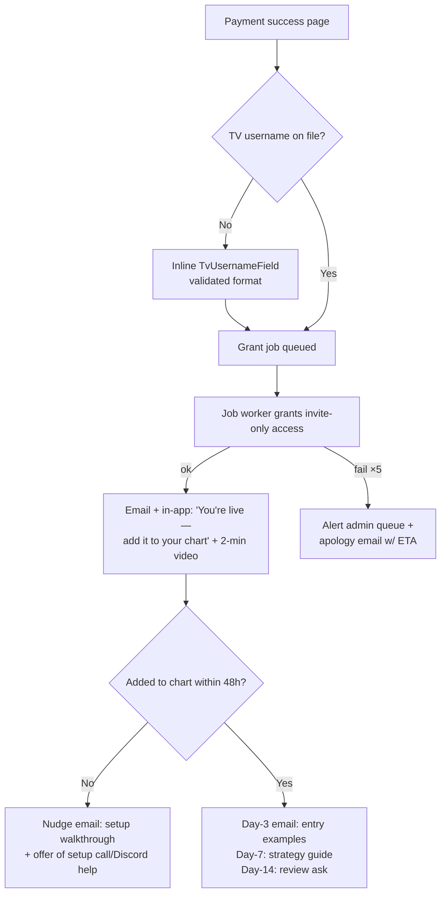
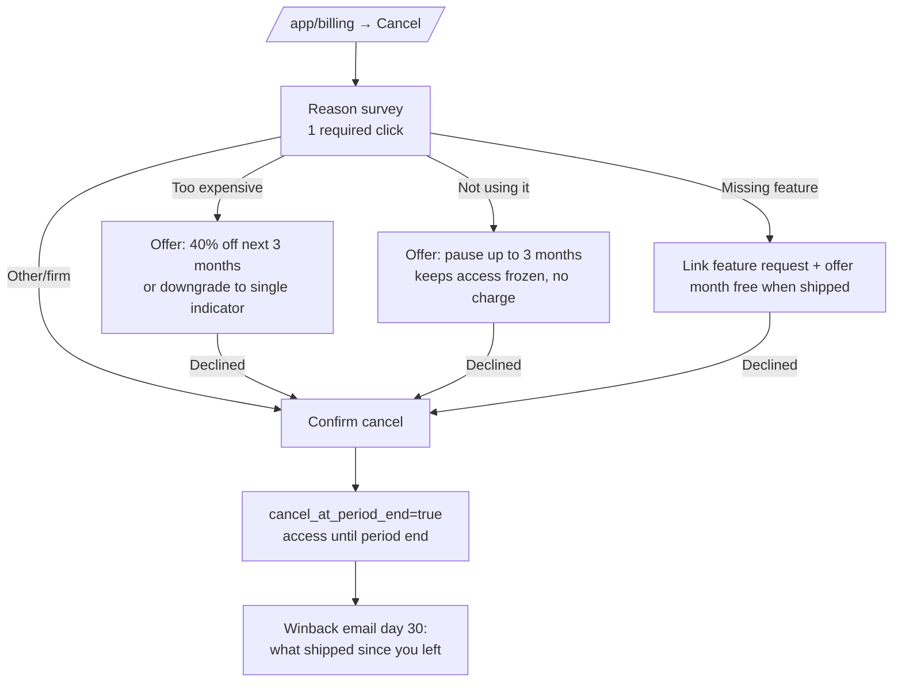
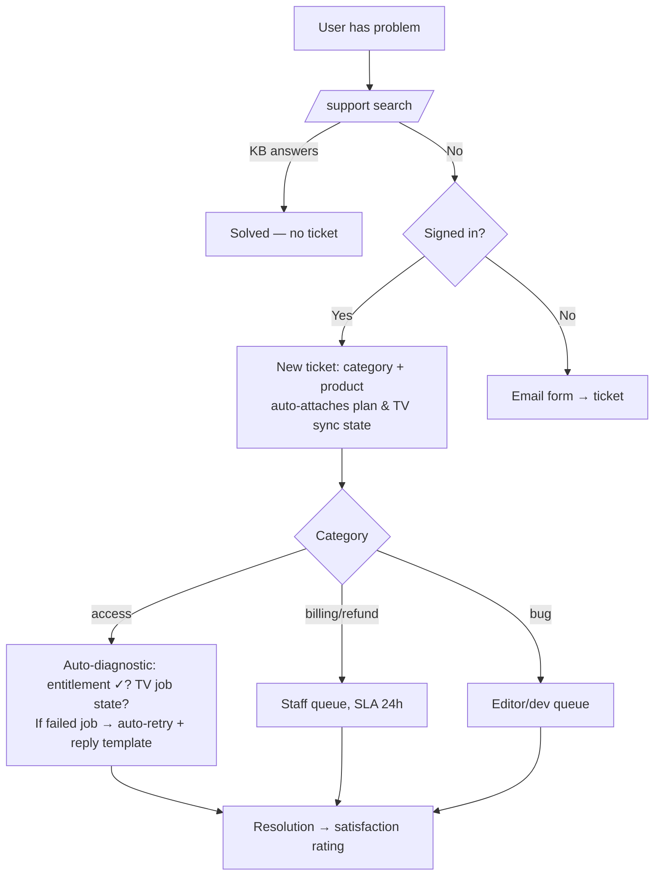
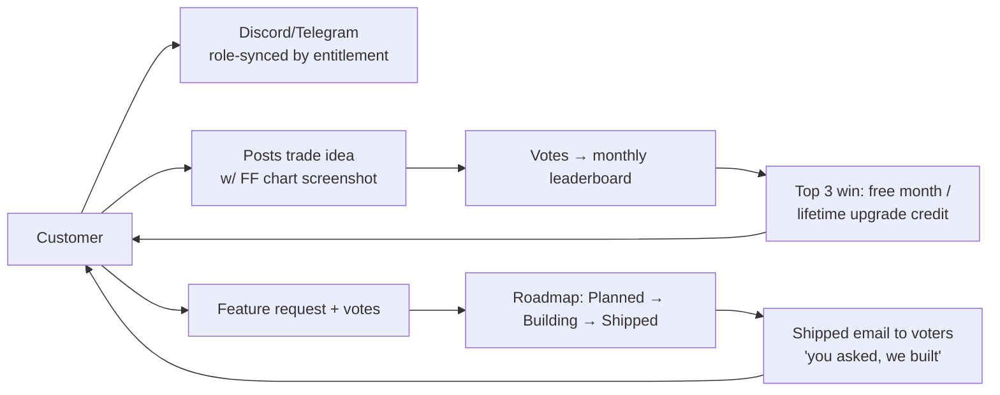
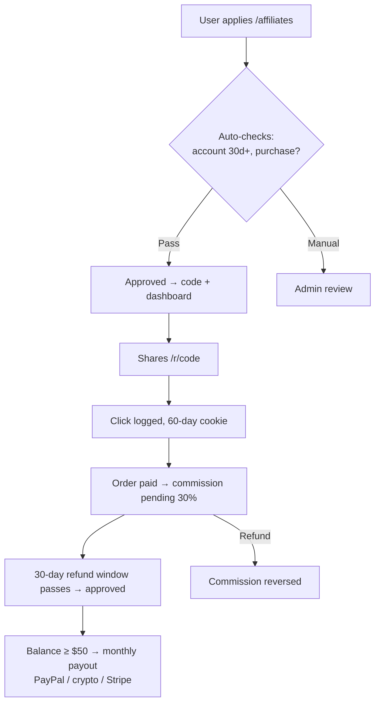
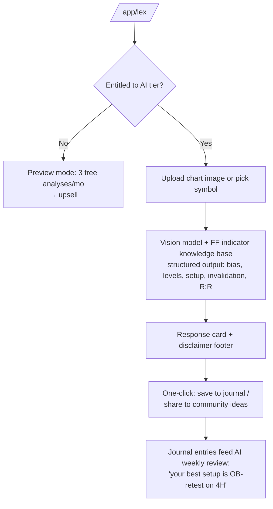

# 06 — User Flow Diagrams

The flows that make or lose money, in order of importance.

## 1. Visitor → Customer (the core funnel)



**Conversion levers marked in the wireframes:** playground gate, sticky mobile buy bar,
annual-plan anchoring, bundle upsell on every product page, exit-intent free-indicator
offer (max once per session).

## 2. First-run activation (post-purchase — where churn is decided)



## 3. Free-indicator lead magnet

```mermaid
flowchart LR
    A[/free/slug] --> B[Email form<br/>source tagged]
    B --> C[Instant: TV access link +<br/>welcome email]
    C --> D[Drip: value ×3 →<br/>discount offer day 7]
    D --> E{Buys?}
    E -->|Yes| F[Lead.converted_user_id set<br/>attribution recorded]
    E -->|No| G[Monthly newsletter pool]
```

## 4. Cancel / retention flow



## 5. Support flow (deflection-first)



## 6. Community engagement loop (retention engine)



## 7. Affiliate flow



## 8. Lex (AI Copilot) session — Phase 3


