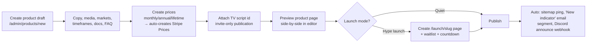

# 07 — Admin Workflow

The admin panel (`/admin`) is a first-class product surface: your leverage as a founder
is proportional to how much of the business runs without touching code or a database
console.

## Roles (RBAC)

| Role | Can |
|------|-----|
| `owner` | Everything + team management, API keys, payout approval, feature flags |
| `admin` | Products, pricing, customers, refunds, licenses, analytics, newsletters |
| `editor` | Content (blog/guides/KB/docs), product copy & media, roadmap items |
| `support` | Tickets, customer read view, license retry/resync, KB drafts |

Every admin mutation writes `audit_log` (actor, action, subject, diff). Admin routes
require 2FA. Impersonation shows a persistent banner and is logged start/stop.

## Daily operating rhythm (the founder dashboard)

`/admin` opens to yesterday-vs-trend: **MRR · new customers · churned · failed payments
· open tickets · TV sync failures · disputes**. Anything red is clickable straight into
the queue that fixes it. Target: 15 minutes/day keeps the machine healthy.

## Workflow: ship a new indicator

## Workflow: publish an update (version)

1. `/admin/products/[id]/versions` → New version: number, changelog (MDX), optional files.
2. Update the invite-only script on TradingView (manual, on TV itself).
3. Publish → customers with the entitlement get: in-app "update available" badge,
   changelog email (batched daily), Discord `#updates` webhook post.
4. Changelog appears on the public product page — active development is a sales asset.

## Workflow: refunds & disputes

- `/admin/orders` → order → **Refund** drawer: full/partial, reason (required),
  "revoke access" toggle (default ON for full refunds within guarantee).
- Auto: Stripe/PayPal refund API → order status → commission reversal → revoke jobs →
  templated email. One screen, ~20 seconds.
- Disputes: webhook flags order, dashboard alert; evidence pack auto-drafted from
  license_events (proof of access delivery + usage) — the #1 chargeback defense.

## Workflow: license ops

`/admin/licenses` shows the TV sync queue. Failed jobs (bad username, TV rate limits)
surface with one-click **Retry** / **Edit username & retry**. Bulk actions: re-sync all
entitlements for a product (e.g., after republish), export active usernames per script.

## Workflow: customer management

Customer 360 at `/admin/customers/[id]`: profile, LTV, plan, entitlements (grant/revoke
with reason), orders, tickets, emails sent, community flags, notes. Common actions are
buttons, not SQL: extend access 7 days (goodwill), send password reset, apply coupon,
convert sub → lifetime (custom invoice).

## Workflow: content & newsletters

- Content: TipTap editor → MDX; status `draft → review → published`; SEO fields with
  live SERP preview; scheduled publishing.
- Newsletter: compose → segment (all leads / customers of product X / churned / inactive
  30d) → test send → schedule via Resend Broadcasts. Every send records
  UTM-tagged links for revenue attribution.

## Workflow: affiliate ops

Monthly, ~30 min: review pending applications, scan flagged self-referrals
(same-IP/same-card heuristics), approve commission batch (auto-approved after refund
window; this is a review, not data entry), trigger payouts, export for accounting.

## Alerting (pushed, not polled)

Slack/Discord webhook + email for: payment provider webhook failures, TV sync job at
max retries, dispute opened, churn spike (>2× 7-day average), site error-rate spike
(Sentry), affiliate fraud heuristic hit.
