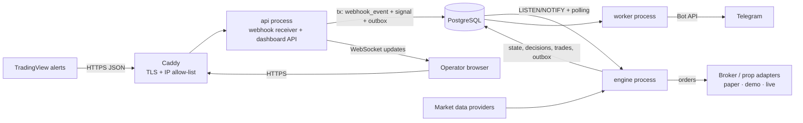
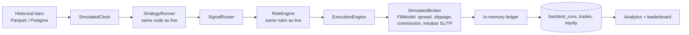

# 1. Proposed Architecture

## 1.1 Guiding principles

1. **One pipeline, many modes.** Strategy code, the risk engine, position
   accounting and the fill/exit logic are *the same code* in BACKTEST, PAPER,
   DEMO and LIVE. Only three things are swapped per mode: the **clock**, the
   **market-data source** and the **broker adapter**. This is what makes
   "compare strategies under identical market and risk conditions" true rather
   than approximately true, and it means a strategy that passed paper trading
   is running the exact code that will later trade live.
2. **Strategies propose, the risk engine disposes.** A strategy can only emit a
   `Signal`. It cannot size a position, see broker credentials or place an
   order. Every order is created by the risk engine (as an `ApprovedOrder`)
   and the execution engine accepts nothing else.
3. **Plug-ins, not edits.** Strategies, broker adapters, notifiers, risk rules
   and market-data providers are registered plug-ins discovered at start-up.
   Adding one never requires editing the core.
4. **Everything is auditable.** Every inbound request, signal, risk decision,
   order, fill and exit is persisted with a correlation ID so any trade can be
   reconstructed after the fact (see [04-database-schema](04-database-schema.md#49-the-audit-trail-explaining-a-trade)).
5. **Fail closed.** Missing data, stale prices, an unknown strategy, a broker
   disconnect or an exception in a risk rule all result in *no new trade*, a
   recorded reason and an alert. Risk-*reducing* actions (exits, tighter stops,
   flattening) are always allowed.
6. **LIVE is opt-in, multi-key and never the default.**

## 1.2 Architectural style: modular monolith, hexagonal modules

The backend is **one Python codebase** (`kterminal`) deployed as **several
processes** built from the same Docker image. Inside the codebase each of the
13 modules is a package with an explicit public interface ("port") and
pluggable implementations ("adapters"). Module dependencies are *enforced in
CI* by `import-linter` contracts (e.g. strategies may not import brokers; the
core kernel imports nothing).

Why not microservices? The workload is small (signals per minute, not per
microsecond), consistency matters more than independent scaling (a signal,
its risk decision and its order must be committed atomically for the audit
trail), and a single operator benefits from one deployable unit. Because
module boundaries are enforced, any module (e.g. the webhook receiver or the
Telegram service) can be split into its own service later without rewrites.

## 1.3 Process roles

| Process | Command | Responsibilities | Holds broker credentials? | Instances |
|---|---|---|---|---|
| `api` | `kterminal api` | TradingView webhook receiver, dashboard REST + WebSocket API, auth | **No** | 1..n (stateless) |
| `engine` | `kterminal engine` | Signal routing, internal strategies on live bars, risk engine, execution engine, broker adapters, position & equity monitors, kill-switch enforcement | Yes (only this process) | **Exactly 1 active** (Postgres advisory-lock leader election; others stand by) |
| `worker` | `kterminal worker` | Telegram delivery, scheduled daily/weekly reports, analytics recomputation, backtest jobs | No | 1..n |
| `postgres` | — | System of record + durable job/event queue (transactional outbox) | — | 1 |
| `caddy` | — | TLS termination, automatic HTTPS, TradingView IP allow-list, static dashboard | — | 1 |

The webhook-facing `api` process never receives broker credentials. Even a
full compromise of the internet-facing process cannot place a trade directly:
it can only insert a signal, which must still pass the risk engine inside the
`engine` process.

The `engine` is a single active instance because order sequencing, position
state and per-account risk checks must be serialized. A standby engine waits
on the same advisory lock and takes over automatically if the active one dies.

## 1.4 System context



## 1.5 The 13 modules

| # | Module (package) | Responsibility | Key ports / types |
|---|---|---|---|
| 1 | **Strategy Engine** (`strategy_engine`, plug-ins in `strategies`) | Strategy SDK (base class, context, params), discovery/registry, `StrategyRunner` that feeds closed bars and collects signals; also the definition of *external* (TradingView) strategies | `Strategy`, `StrategyContext`, `Signal`, `StrategyRegistry` |
| 2 | **Backtesting Engine** (`backtest`) | Replays historical bars on a simulated clock through the *same* runner → risk → execution pipeline with a simulated broker; also replays recorded external signals ("signal replay") | `BacktestConfig`, `BacktestRun`, `FillModel` |
| 3 | **Forward/Paper Trading Engine** (`paper`) | Virtual prop-style accounts, real-time paper fills from live quotes, account lifecycle (active / locked-for-day / breached / passed) | `VirtualAccount`, `PaperBroker` |
| 4 | **Market Data Layer** (`marketdata`) | Historical import (CSV/Parquet), live quote & bar feeds, bar aggregation, staleness detection, symbol normalization, data fingerprints for audit | `MarketDataProvider`, `Bar`, `Quote`, `InstrumentSpec` |
| 5 | **TradingView Webhook Receiver** (`webhook`) | Authenticate, validate, normalize, de-duplicate, persist and enqueue TradingView alerts in < 250 ms | `WebhookPayloadV1`, `IdempotencyKey` |
| 6 | **Risk Management Engine** (`risk`) | Pure, deterministic pre-trade rule pipeline, position sizing, prop-rule models, continuous equity monitor, kill switch | `RiskEngine`, `RiskRule`, `RiskDecision`, `ApprovedOrder` |
| 7 | **Execution Engine** (`execution`) | Signal router (fan-out to accounts), order manager & state machine, position manager, bracket/stop management, reconciliation with broker | `ExecutionEngine`, `OrderManager`, `PositionManager` |
| 8 | **Broker/Prop Adapters** (`brokers`) | One adapter per venue implementing the standard broker interface; capabilities descriptor; symbol mapping | `BrokerAdapter`, `BrokerCapabilities` |
| 9 | **Performance Analytics** (`analytics`) | Metrics, breakdowns (strategy/symbol/timeframe/session/day/week/month), leaderboard, report data | `MetricsCalculator`, `Leaderboard` |
| 10 | **Database** (`db`) | SQLAlchemy models, Alembic migrations, repositories, outbox, advisory locks, hash-chained audit log | `Database`, repositories |
| 11 | **Telegram Notification Service** (`notifications`) | Event → notification policy → template → outbox → rate-limited delivery; scheduled reports; (later) operator commands | `Notifier`, `NotificationPolicy` |
| 12 | **Web Dashboard** (`api` backend + `terminal/dashboard` SPA) | REST/WebSocket API and the dark trading-terminal UI | OpenAPI schema |
| 13 | **Logging/Audit** (`observability` + `db.audit`) | Structured JSON logs with correlation IDs and secret redaction, metrics, append-only audit log | `get_logger`, `AuditLog` |

Supporting packages: `core` (shared kernel: enums, IDs, clock, errors, event
bus, plug-in registry), `config` (typed settings + LIVE guard), `indicators`
(Pine-compatible indicator functions), `runtime` (composition root that wires
modules per process) and `cli`.

### Allowed dependencies (enforced by import-linter)

```
cli
 └─ runtime                      (composition root: the only place that wires concrete adapters)
     └─ api
         └─ webhook | paper | backtest | notifications      (application services, mutually independent)
             └─ execution | analytics
                 └─ risk | brokers | strategies
                     └─ strategy_engine | marketdata | indicators
                         └─ db
                             └─ observability
                                 └─ config
                                     └─ core              (imports nothing from kterminal)
```

Additional *forbidden* contracts:

* `strategies` may not import `brokers`, `execution`, `risk`, `db`, `api`,
  `webhook`, `notifications`, `paper`, `backtest` or `runtime` — a strategy
  cannot touch money.
* `risk` may not import `brokers`, `execution`, `api`, `webhook`,
  `notifications`, `strategies`, `paper` or `backtest` — the risk engine is
  pure and cannot be bypassed from inside.
* Only `execution`, `paper`, `backtest` and `runtime` may import `brokers`.

## 1.6 Signal-to-trade flow (live / paper)

```mermaid
sequenceDiagram
    autonumber
    participant TV as TradingView
    participant API as api: webhook receiver
    participant DB as PostgreSQL
    participant EN as engine: SignalRouter
    participant RK as RiskEngine
    participant EX as ExecutionEngine
    participant BR as BrokerAdapter
    participant WK as worker: Telegram

    TV->>API: POST /api/v1/webhooks/tradingview
    API->>API: size, IP, JSON, schema, secret, timestamp,<br/>strategy, symbol, idempotency checks
    API->>DB: BEGIN; webhook_event; signal; outbox(signal.received); COMMIT
    API-->>TV: 202 Accepted (signal_id)
    DB-->>EN: NOTIFY outbox
    EN->>EN: load allocations: which accounts trade this strategy
    loop each allocated account (serialized per account)
        EN->>RK: evaluate(OrderIntent, AccountState, RiskProfile, Instrument, Quote)
        RK-->>EN: RiskDecision (all rule results, approved qty)
        EN->>DB: risk_decision (+ outbox: trade.approved / trade.rejected)
        alt approved
            EN->>EX: submit(ApprovedOrder)
            EX->>BR: place_order(...)
            BR-->>EX: ack / fill
            EX->>DB: order, order_events, fills, trade (+ outbox: trade.opened)
        end
    end
    DB-->>WK: outbox
    WK->>WK: policy + template + rate limit
    WK-->>WK: Telegram sendMessage
```

Internal (Python) strategies enter the same flow at the `SignalRouter`: the
market-data layer emits a *closed* bar → `StrategyRunner.on_bar()` → signals
are persisted exactly like webhook signals (source `INTERNAL`) → router.

## 1.7 Backtest flow



* Signals are generated on bar close and filled at the next bar's open by
  default — no look-ahead, and equal to Pine's default
  (`process_orders_on_close=false`).
* When a single bar touches both stop-loss and take-profit, the default
  assumption is **stop first** (conservative). If lower-timeframe data is
  available the engine resolves the ambiguity with it.
* **Signal replay** mode backtests a TradingView strategy without porting it:
  recorded/exported signals are replayed against our market data with our
  fill model and risk rules, so a TradingView strategy and a ported Python
  strategy can be compared under identical conditions.
* Every run stores a data fingerprint (provider, symbol, range, row count,
  content hash) so results are reproducible.

## 1.8 Accounts, allocations and fair comparison

* **Account** — a ledger with a mode (`PAPER`, `DEMO`, `LIVE`; `BACKTEST`
  accounts are ephemeral), a starting balance, a currency, a broker adapter
  and a **risk profile**.
* **Risk profile** — a named, versioned set of prop-style rules (risk per
  trade, daily loss, max drawdown static/trailing, max positions, sessions,
  symbols, min R:R, max trades per day, profit target).
* **Allocation** — "strategy S trades on account A". One signal fans out to
  every enabled allocation; each produces its own risk decision and order.

The default setup gives **every strategy its own virtual account** with the
same starting balance (e.g. $50,000) and the **same risk profile**. Because
sizing is risk-based, results are comparable both in currency and in R
multiples. A real prop/live account can later be allocated to one validated
strategy while that strategy keeps its paper account running in parallel
("shadow" tracking: divergence between paper and live is itself a metric).

Balances change only through ledger entries (realized P&L, commissions,
swaps, deposits/resets), so `balance = Σ ledger` is always provable.

## 1.9 Events and inter-process communication

* **In-process event bus** (`core.events`): typed domain events such as
  `SignalReceived`, `RiskApproved`, `RiskRejected`, `OrderFilled`,
  `TradeOpened`, `TradeClosed`, `StopMoved`, `BreakevenActivated`,
  `RiskWarning`, `KillSwitchActivated`, `ConnectionLost`. Subscribers are
  isolated: a failing subscriber is logged and never breaks the publisher.
* **Cross-process delivery** uses a **transactional outbox** table in
  Postgres: an event that must leave the process (e.g. a Telegram
  notification) is inserted *in the same transaction* as the state change that
  caused it. Consumers wake on `LISTEN/NOTIFY` and fall back to polling with
  `SELECT … FOR UPDATE SKIP LOCKED`. No dual-write problem, no lost
  notifications, and every message is auditable.
* **Dashboard real-time** updates are pushed over WebSocket by the `api`
  process, which listens to the same notifications.

## 1.10 Time, money and precision

* All timestamps are timezone-aware **UTC** (`timestamptz`). Sessions and
  "trading day" boundaries are defined per risk profile in an IANA time zone
  (e.g. `America/New_York` 17:00) and evaluated with `zoneinfo`, so DST is
  handled correctly.
* Prices, quantities and money are `Decimal` in the domain and `NUMERIC` in
  the database. Indicator maths inside strategies may use floats/numpy; values
  are converted to `Decimal` at the `Signal` boundary.
* Every component reads time from an injected `Clock` (`SystemClock` live,
  `SimulatedClock` in backtests) — never `datetime.now()` directly — which is
  what makes backtests deterministic and replayable.

## 1.11 Strategy lifecycle and promotion

```
DRAFT → BACKTESTED → PAPER → DEMO → LIVE_APPROVED → RETIRED
```

Promotion between stages is gated by configurable, recorded criteria (see
[10-roadmap](10-roadmap.md#live-promotion-gates)). A strategy can only be
allocated to a `LIVE` account once it is `LIVE_APPROVED`.

## 1.12 Execution modes

| Mode | Clock | Data | Broker adapter | Real money |
|---|---|---|---|---|
| `BACKTEST` | Simulated | Historical | `SimulatedBroker` | No |
| `PAPER` | System | Live feed | `PaperBroker` (internal fills) | No |
| `DEMO` | System | Live feed / broker | Real broker API, demo environment | No |
| `LIVE` | System | Live feed / broker | Real broker API, live environment | **Yes** |

`LIVE` requires all of: the global master switch, a typed acknowledgement
phrase, an account explicitly set to `LIVE` by an admin with 2FA, a
`LIVE_APPROVED` strategy and an adapter that declares live support. See
[09-security](09-security.md#93-live-trading-safety-interlocks).
