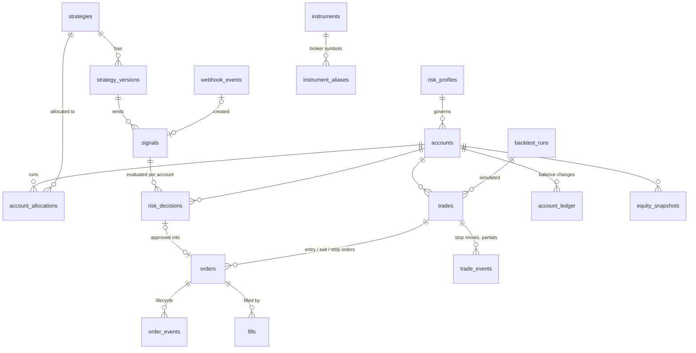

# 4. Database Schema (PostgreSQL 16)

This is the logical schema that Phase 2 turns into Alembic migrations.
Conventions:

* Primary keys are **UUIDv7** (time-ordered, index-friendly) unless noted.
  `strategies.id` is the human-readable `strategy_id` slug (e.g.
  `breakout_retest`).
* Every timestamp is `timestamptz` in UTC.
* Prices and quantities are `NUMERIC(24,10)`; money is `NUMERIC(20,4)` in the
  account currency. Never `float`.
* Enumerations are `text` + `CHECK` constraints (easier to evolve than
  Postgres `ENUM` types); the allowed values mirror `kterminal.core.enums`.
* `jsonb` holds *snapshots* (the exact config/state a decision used), never
  data that must be queried relationally.
* `correlation_id` is propagated from the first event (webhook request or
  closed bar) through every row it causes.
* High-volume tables (`webhook_events`, `order_events`, `equity_snapshots`,
  `candles`, `audit_log`) are declared range-partitioned by month from day
  one so retention is a cheap `DROP PARTITION`.

## 4.1 Entity-relationship overview



## 4.2 Reference & configuration

```sql
CREATE TABLE instruments (
    symbol            text PRIMARY KEY,                 -- canonical, e.g. 'XAUUSD'
    asset_class       text NOT NULL CHECK (asset_class IN ('FX','METAL','INDEX','FUTURE','CRYPTO','EQUITY','CFD')),
    quote_currency    text NOT NULL,                    -- e.g. 'USD'
    tick_size         numeric(24,10) NOT NULL,          -- 0.01
    contract_size     numeric(24,10) NOT NULL,          -- units per 1.0 lot / contract (100 oz)
    min_qty           numeric(24,10) NOT NULL,
    qty_step          numeric(24,10) NOT NULL,
    sessions          jsonb NOT NULL DEFAULT '{}',      -- trading hours per weekday + tz
    enabled           boolean NOT NULL DEFAULT true,
    created_at        timestamptz NOT NULL DEFAULT now()
);

CREATE TABLE instrument_aliases (                       -- 'OANDA:XAUUSD', 'XAU_USD', 'GC1!' → 'XAUUSD'
    source            text NOT NULL,                    -- 'tradingview', 'oanda', 'tradovate', …
    alias             text NOT NULL,
    symbol            text NOT NULL REFERENCES instruments(symbol),
    PRIMARY KEY (source, alias)
);

CREATE TABLE strategies (
    id                text PRIMARY KEY,                 -- strategy_id slug, immutable
    name              text NOT NULL,
    kind              text NOT NULL CHECK (kind IN ('INTERNAL','EXTERNAL')),  -- Python plug-in or TradingView
    status            text NOT NULL DEFAULT 'DRAFT'
                      CHECK (status IN ('DRAFT','BACKTESTED','PAPER','DEMO','LIVE_APPROVED','RETIRED')),
    description       text,
    allowed_symbols   text[] ,                          -- NULL = any enabled instrument
    allowed_timeframes text[],
    webhook_secret_hashes jsonb NOT NULL DEFAULT '[]',  -- [{hash, created_at, expires_at}] supports rotation
    enabled           boolean NOT NULL DEFAULT true,
    created_at        timestamptz NOT NULL DEFAULT now(),
    updated_at        timestamptz NOT NULL DEFAULT now()
);

CREATE TABLE strategy_versions (                        -- exact code + params that produced a signal
    id                uuid PRIMARY KEY,
    strategy_id       text NOT NULL REFERENCES strategies(id),
    version           text NOT NULL,                    -- semantic version declared by the plug-in
    code_hash         text,                             -- sha256 of the plug-in source (INTERNAL)
    params            jsonb NOT NULL DEFAULT '{}',
    params_hash       text NOT NULL,
    created_at        timestamptz NOT NULL DEFAULT now(),
    UNIQUE (strategy_id, version, params_hash)
);

CREATE TABLE strategy_promotions (                      -- audit of lifecycle changes + gate evidence
    id                uuid PRIMARY KEY,
    strategy_id       text NOT NULL REFERENCES strategies(id),
    from_status       text NOT NULL,
    to_status         text NOT NULL,
    evidence          jsonb NOT NULL,                   -- metrics that satisfied the gate
    approved_by       uuid REFERENCES users(id),
    created_at        timestamptz NOT NULL DEFAULT now()
);
```

## 4.3 Accounts & risk configuration

```sql
CREATE TABLE risk_profiles (                            -- immutable versions; edits create a new row
    id                uuid PRIMARY KEY,
    name              text NOT NULL,                    -- 'prop-50k-standard'
    version           integer NOT NULL,
    config            jsonb NOT NULL,                   -- validated by kterminal.risk.RiskProfileConfig
    created_at        timestamptz NOT NULL DEFAULT now(),
    UNIQUE (name, version)
);

CREATE TABLE accounts (
    id                uuid PRIMARY KEY,
    name              text NOT NULL UNIQUE,             -- 'Paper 50K – breakout_retest'
    mode              text NOT NULL CHECK (mode IN ('BACKTEST','PAPER','DEMO','LIVE')),
    broker            text NOT NULL,                    -- registered adapter name: 'paper', 'oanda', …
    broker_account_ref text,                            -- external account id (masked in UI/logs)
    currency          text NOT NULL DEFAULT 'USD',
    starting_balance  numeric(20,4) NOT NULL,
    risk_profile_id   uuid NOT NULL REFERENCES risk_profiles(id),
    status            text NOT NULL DEFAULT 'ACTIVE'
                      CHECK (status IN ('ACTIVE','LOCKED_FOR_DAY','BREACHED','PASSED','PAUSED','CLOSED')),
    high_water_mark   numeric(20,4) NOT NULL,           -- for trailing drawdown
    live_enabled_by   uuid REFERENCES users(id),        -- required (with 2FA) when mode = 'LIVE'
    live_enabled_at   timestamptz,
    created_at        timestamptz NOT NULL DEFAULT now(),
    CHECK (mode <> 'LIVE' OR live_enabled_by IS NOT NULL)
);

CREATE TABLE account_allocations (                      -- which strategies trade on which account
    account_id        uuid NOT NULL REFERENCES accounts(id),
    strategy_id       text NOT NULL REFERENCES strategies(id),
    enabled           boolean NOT NULL DEFAULT true,
    risk_multiplier   numeric(6,4) NOT NULL DEFAULT 1,  -- scales the profile's risk %, capped by it
    PRIMARY KEY (account_id, strategy_id)
);

CREATE TABLE account_ledger (                           -- the ONLY way balances change
    id                uuid PRIMARY KEY,
    account_id        uuid NOT NULL REFERENCES accounts(id),
    ts                timestamptz NOT NULL,
    kind              text NOT NULL CHECK (kind IN ('DEPOSIT','REALIZED_PNL','COMMISSION','SWAP','ADJUSTMENT','RESET')),
    amount            numeric(20,4) NOT NULL,
    balance_after     numeric(20,4) NOT NULL,
    trade_id          uuid REFERENCES trades(id),
    note              text
);

CREATE TABLE equity_snapshots (                         -- partitioned by month on ts
    account_id        uuid NOT NULL,
    ts                timestamptz NOT NULL,
    balance           numeric(20,4) NOT NULL,
    equity            numeric(20,4) NOT NULL,
    open_pnl          numeric(20,4) NOT NULL,
    open_risk         numeric(20,4) NOT NULL,           -- Σ distance-to-stop × size
    daily_pnl         numeric(20,4) NOT NULL,           -- vs. trading-day start per risk profile
    drawdown          numeric(20,4) NOT NULL,           -- vs. high-water mark
    high_water_mark   numeric(20,4) NOT NULL,
    PRIMARY KEY (account_id, ts)
) PARTITION BY RANGE (ts);
```

## 4.4 Signals & webhooks

```sql
CREATE TABLE webhook_events (                           -- every request, accepted or not; partitioned by month
    id                uuid NOT NULL,
    received_at       timestamptz NOT NULL,
    source_ip         inet NOT NULL,
    user_agent        text,
    content_type      text,
    body_redacted     jsonb,                            -- secret removed BEFORE storage
    body_sha256       text NOT NULL,
    status            text NOT NULL CHECK (status IN ('ACCEPTED','DUPLICATE','REJECTED','TEST')),
    reject_code       text,                             -- e.g. 'AUTH_FAILED','STALE_TIMESTAMP','UNKNOWN_SYMBOL'
    reject_detail     text,
    signal_id         uuid,
    processing_ms     integer NOT NULL,
    correlation_id    uuid NOT NULL,
    PRIMARY KEY (id, received_at)
) PARTITION BY RANGE (received_at);

CREATE TABLE signals (
    id                uuid PRIMARY KEY,
    strategy_id       text NOT NULL REFERENCES strategies(id),
    strategy_version_id uuid REFERENCES strategy_versions(id),
    source            text NOT NULL CHECK (source IN ('INTERNAL','TRADINGVIEW','MANUAL','REPLAY')),
    backtest_run_id   uuid REFERENCES backtest_runs(id),-- NULL outside backtests
    symbol            text NOT NULL REFERENCES instruments(symbol),
    timeframe         text NOT NULL,                    -- canonical: '1m','5m','1h','4h','1D'
    signal_time       timestamptz NOT NULL,             -- bar time the strategy evaluated
    received_at       timestamptz NOT NULL,             -- when the terminal got it
    action            text NOT NULL CHECK (action IN ('LONG','SHORT','EXIT_LONG','EXIT_SHORT','MOVE_SL','NO_TRADE')),
    order_type        text NOT NULL DEFAULT 'MARKET',
    entry             numeric(24,10),
    stop_loss         numeric(24,10),
    take_profit       numeric(24,10),
    risk_pct          numeric(8,4),                     -- requested risk; capped by the risk profile
    confidence        numeric(5,4) CHECK (confidence BETWEEN 0 AND 1),
    metadata          jsonb NOT NULL DEFAULT '{}',
    market_snapshot   jsonb NOT NULL DEFAULT '{}',      -- bar/quote/provider/data fingerprint used
    idempotency_key   text NOT NULL UNIQUE,
    status            text NOT NULL DEFAULT 'RECEIVED' CHECK (status IN ('RECEIVED','ROUTED','IGNORED','EXPIRED')),
    correlation_id    uuid NOT NULL
);
CREATE INDEX ON signals (strategy_id, signal_time DESC);
CREATE INDEX ON signals (backtest_run_id) WHERE backtest_run_id IS NOT NULL;
```

`NO_TRADE` signals are not persisted by default (one per bar would swamp the
table); a strategy can mark one as `persist=True` when the *reason* is worth
analysing (e.g. "filtered by news window").

## 4.5 Risk

```sql
CREATE TABLE risk_decisions (
    id                uuid PRIMARY KEY,
    signal_id         uuid NOT NULL REFERENCES signals(id),
    account_id        uuid NOT NULL REFERENCES accounts(id),
    decided_at        timestamptz NOT NULL,
    approved          boolean NOT NULL,
    primary_reason    text,                             -- first failing rule code, NULL if approved
    rule_results      jsonb NOT NULL,                   -- [{rule, passed, code, message, values}] for EVERY rule
    account_state     jsonb NOT NULL,                   -- balance, equity, daily P&L, DD, open positions, trades today
    risk_profile_id   uuid NOT NULL REFERENCES risk_profiles(id),
    quote             jsonb NOT NULL,                   -- bid/ask/ts/provider used for sizing
    requested_qty     numeric(24,10),
    approved_qty      numeric(24,10),
    risk_amount       numeric(20,4),
    risk_pct          numeric(8,4),
    expires_at        timestamptz,                      -- approvals are short-lived
    correlation_id    uuid NOT NULL,
    UNIQUE (signal_id, account_id)
);

CREATE TABLE risk_events (                              -- warnings, breaches, auto-actions
    id                uuid PRIMARY KEY,
    ts                timestamptz NOT NULL,
    account_id        uuid REFERENCES accounts(id),
    strategy_id       text REFERENCES strategies(id),
    kind              text NOT NULL,                    -- DAILY_LOSS_WARNING, DRAWDOWN_WARNING, PROP_RULE_WARNING,
                                                        -- DAILY_LIMIT_HIT, MAX_DRAWDOWN_BREACH, PROFIT_TARGET_HIT,
                                                        -- AUTO_FLATTEN, KILL_SWITCH_ON, KILL_SWITCH_OFF
    severity          text NOT NULL CHECK (severity IN ('INFO','WARNING','CRITICAL')),
    threshold         numeric(8,4),                     -- e.g. 0.75 = 75 % of the limit consumed
    details           jsonb NOT NULL DEFAULT '{}',
    correlation_id    uuid
);

CREATE TABLE kill_switches (                            -- persisted, survives restarts
    scope             text NOT NULL CHECK (scope IN ('GLOBAL','ACCOUNT','STRATEGY')),
    scope_id          text NOT NULL DEFAULT '*',
    active            boolean NOT NULL,
    close_positions   boolean NOT NULL DEFAULT false,
    cancel_orders     boolean NOT NULL DEFAULT true,
    reason            text NOT NULL,
    changed_by        text NOT NULL,                    -- user id, 'system:<rule>' or 'telegram:<user>'
    changed_at        timestamptz NOT NULL,
    PRIMARY KEY (scope, scope_id)
);
```

## 4.6 Orders, fills & trades

```sql
CREATE TABLE trades (                                   -- one round trip (entry → final exit)
    id                uuid PRIMARY KEY,
    account_id        uuid NOT NULL REFERENCES accounts(id),
    strategy_id       text NOT NULL REFERENCES strategies(id),
    entry_signal_id   uuid NOT NULL REFERENCES signals(id),
    exit_signal_id    uuid REFERENCES signals(id),
    backtest_run_id   uuid REFERENCES backtest_runs(id),
    mode              text NOT NULL,
    symbol            text NOT NULL,
    timeframe         text NOT NULL,
    direction         text NOT NULL CHECK (direction IN ('LONG','SHORT')),
    qty               numeric(24,10) NOT NULL,
    entry_requested   numeric(24,10) NOT NULL,
    entry_price       numeric(24,10) NOT NULL,          -- average fill
    entry_time        timestamptz NOT NULL,
    initial_stop      numeric(24,10) NOT NULL,
    initial_target    numeric(24,10),
    current_stop      numeric(24,10),
    exit_price        numeric(24,10),
    exit_time         timestamptz,
    exit_reason       text CHECK (exit_reason IN ('TAKE_PROFIT','STOP_LOSS','BREAKEVEN_STOP','TRAILING_STOP',
                         'SIGNAL_EXIT','MANUAL','KILL_SWITCH','RISK_FLATTEN','SESSION_CLOSE','BROKER_LIQUIDATION')),
    initial_risk      numeric(20,4) NOT NULL,           -- |entry_price − initial_stop| × qty × value/unit
    gross_pnl         numeric(20,4),
    commission        numeric(20,4) NOT NULL DEFAULT 0,
    swap              numeric(20,4) NOT NULL DEFAULT 0,
    net_pnl           numeric(20,4),
    r_multiple        numeric(10,4),                    -- net_pnl / initial_risk
    entry_slippage    numeric(24,10),                   -- adverse-positive, price units
    exit_slippage     numeric(24,10),
    mae               numeric(24,10),                   -- max adverse excursion (price)
    mfe               numeric(24,10),                   -- max favourable excursion
    session           text,                             -- 'ASIA','LONDON','NEW_YORK', … at entry
    status            text NOT NULL CHECK (status IN ('OPEN','CLOSED')),
    correlation_id    uuid NOT NULL
);
CREATE INDEX ON trades (strategy_id, exit_time);
CREATE INDEX ON trades (account_id, status);
CREATE INDEX ON trades (backtest_run_id) WHERE backtest_run_id IS NOT NULL;

CREATE TABLE orders (
    id                uuid PRIMARY KEY,
    client_order_id   text NOT NULL UNIQUE,             -- idempotent submission to the broker
    broker_order_id   text,
    account_id        uuid NOT NULL REFERENCES accounts(id),
    trade_id          uuid REFERENCES trades(id),
    signal_id         uuid REFERENCES signals(id),
    risk_decision_id  uuid REFERENCES risk_decisions(id), -- NOT NULL for any risk-increasing order
    parent_order_id   uuid REFERENCES orders(id),       -- SL/TP legs of a bracket
    purpose           text NOT NULL CHECK (purpose IN ('ENTRY','STOP_LOSS','TAKE_PROFIT','EXIT','FLATTEN')),
    mode              text NOT NULL,
    symbol            text NOT NULL,
    side              text NOT NULL CHECK (side IN ('BUY','SELL')),
    order_type        text NOT NULL CHECK (order_type IN ('MARKET','LIMIT','STOP','STOP_LIMIT')),
    qty               numeric(24,10) NOT NULL,
    requested_price   numeric(24,10),                   -- reference/limit/stop price
    time_in_force     text NOT NULL DEFAULT 'GTC',
    status            text NOT NULL,                    -- PENDING_SUBMIT → SUBMITTED → ACCEPTED → PARTIALLY_FILLED
                                                        -- → FILLED | CANCELLED | REJECTED | EXPIRED | FAILED
    filled_qty        numeric(24,10) NOT NULL DEFAULT 0,
    avg_fill_price    numeric(24,10),
    slippage          numeric(24,10),
    commission        numeric(20,4) NOT NULL DEFAULT 0,
    reject_reason     text,
    created_at        timestamptz NOT NULL,
    submitted_at      timestamptz,
    acknowledged_at   timestamptz,
    completed_at      timestamptz,
    correlation_id    uuid NOT NULL,
    CHECK (purpose NOT IN ('ENTRY') OR risk_decision_id IS NOT NULL)
);

CREATE TABLE order_events (                             -- every state transition + raw broker payload; partitioned
    id                uuid NOT NULL,
    order_id          uuid NOT NULL,
    ts                timestamptz NOT NULL,
    from_status       text,
    to_status         text NOT NULL,
    broker_payload    jsonb,                            -- credentials never present; account refs masked
    PRIMARY KEY (id, ts)
) PARTITION BY RANGE (ts);

CREATE TABLE fills (
    id                uuid PRIMARY KEY,
    order_id          uuid NOT NULL REFERENCES orders(id),
    broker_fill_id    text,
    ts                timestamptz NOT NULL,
    qty               numeric(24,10) NOT NULL,
    price             numeric(24,10) NOT NULL,
    commission        numeric(20,4) NOT NULL DEFAULT 0,
    liquidity         text,                             -- MAKER / TAKER when known
    UNIQUE (order_id, broker_fill_id)
);

CREATE TABLE trade_events (                             -- MOVE_SL, BREAKEVEN, partial close, target change
    id                uuid PRIMARY KEY,
    trade_id          uuid NOT NULL REFERENCES trades(id),
    ts                timestamptz NOT NULL,
    kind              text NOT NULL CHECK (kind IN ('STOP_MOVED','BREAKEVEN','TARGET_MOVED','PARTIAL_CLOSE','NOTE')),
    old_value         numeric(24,10),
    new_value         numeric(24,10),
    signal_id         uuid REFERENCES signals(id),
    details           jsonb NOT NULL DEFAULT '{}'
);
```

Backtest runs store `trades` (with `backtest_run_id`) and an equity curve;
individual backtest orders/fills are only persisted when the run is
configured with `persist_orders=true` (debugging), which keeps large
parameter sweeps cheap.

## 4.7 Backtests, analytics & market data

```sql
CREATE TABLE backtest_runs (
    id                uuid PRIMARY KEY,
    strategy_version_id uuid NOT NULL REFERENCES strategy_versions(id),
    kind              text NOT NULL CHECK (kind IN ('BARS','SIGNAL_REPLAY')),
    config            jsonb NOT NULL,                   -- symbols, timeframe, range, fill model, costs, risk profile
    data_fingerprint  jsonb NOT NULL,                   -- provider, range, rows, content sha256 per symbol
    status            text NOT NULL CHECK (status IN ('QUEUED','RUNNING','COMPLETED','FAILED','CANCELLED')),
    started_at        timestamptz,
    finished_at       timestamptz,
    summary           jsonb,                            -- headline metrics
    error             text
);

CREATE TABLE performance_metrics (                      -- cache; trades remain the source of truth
    id                uuid PRIMARY KEY,
    scope             text NOT NULL CHECK (scope IN ('STRATEGY','ACCOUNT','BACKTEST_RUN')),
    scope_id          text NOT NULL,
    mode              text NOT NULL,
    dimension         text NOT NULL,                    -- 'ALL','SYMBOL','TIMEFRAME','SESSION','DAY','WEEK','MONTH','DIRECTION'
    bucket            text NOT NULL,                    -- 'XAUUSD', '2026-W41', 'LONG', …
    period_start      timestamptz,
    period_end        timestamptz,
    metrics           jsonb NOT NULL,                   -- see appendix A for definitions
    trade_count       integer NOT NULL,
    computed_at       timestamptz NOT NULL,
    UNIQUE (scope, scope_id, mode, dimension, bucket)
);

CREATE TABLE candles (                                  -- bars that drove paper/live decisions; partitioned
    symbol            text NOT NULL,
    timeframe         text NOT NULL,
    ts                timestamptz NOT NULL,             -- bar open time
    open numeric(24,10) NOT NULL, high numeric(24,10) NOT NULL,
    low  numeric(24,10) NOT NULL, close numeric(24,10) NOT NULL,
    volume            numeric(24,10),
    source            text NOT NULL,
    PRIMARY KEY (symbol, timeframe, source, ts)
) PARTITION BY RANGE (ts);
```

## 4.8 Notifications, system & audit

```sql
CREATE TABLE outbox (                                   -- transactional outbox for cross-process events
    id                bigserial PRIMARY KEY,
    topic             text NOT NULL,                    -- 'signal.received', 'trade.opened', …
    payload           jsonb NOT NULL,
    created_at        timestamptz NOT NULL DEFAULT now(),
    available_at      timestamptz NOT NULL DEFAULT now(),
    attempts          integer NOT NULL DEFAULT 0,
    processed_at      timestamptz,
    last_error        text
);
CREATE INDEX ON outbox (topic, available_at) WHERE processed_at IS NULL;

CREATE TABLE notifications (                            -- = "Telegram events"
    id                uuid PRIMARY KEY,
    channel           text NOT NULL DEFAULT 'telegram',
    destination       text NOT NULL,                    -- logical route ('trades','alerts','reports'), not a raw chat id
    event_type        text NOT NULL,                    -- TRADE_OPENED, KILL_SWITCH_ACTIVATED, DAILY_REPORT, …
    dedupe_key        text,                             -- suppresses repeats (e.g. one DD warning per threshold per day)
    payload           jsonb NOT NULL,
    rendered_text     text NOT NULL,
    status            text NOT NULL CHECK (status IN ('PENDING','SENT','FAILED','SUPPRESSED')),
    attempts          integer NOT NULL DEFAULT 0,
    provider_message_id text,
    error             text,
    created_at        timestamptz NOT NULL,
    sent_at           timestamptz,
    correlation_id    uuid,
    UNIQUE (channel, dedupe_key)
);

CREATE TABLE report_runs (                              -- scheduled reports are sent exactly once
    report            text NOT NULL,                    -- 'DAILY','WEEKLY'
    period_key        text NOT NULL,                    -- '2026-10-05', '2026-W41'
    status            text NOT NULL,
    created_at        timestamptz NOT NULL,
    PRIMARY KEY (report, period_key)
);

CREATE TABLE system_errors (
    id                uuid PRIMARY KEY,
    ts                timestamptz NOT NULL,
    component         text NOT NULL,                    -- 'engine.execution', 'broker.oanda', …
    severity          text NOT NULL CHECK (severity IN ('WARNING','ERROR','CRITICAL')),
    message           text NOT NULL,
    exception         text,                             -- type + traceback (redacted)
    context           jsonb NOT NULL DEFAULT '{}',
    correlation_id    uuid
);

CREATE TABLE system_state (                             -- heartbeats, leader identity, feature flags
    key               text PRIMARY KEY,
    value             jsonb NOT NULL,
    updated_at        timestamptz NOT NULL
);

CREATE TABLE users (
    id                uuid PRIMARY KEY,
    username          text NOT NULL UNIQUE,
    password_hash     text NOT NULL,                    -- argon2id
    totp_secret_enc   bytea,                            -- encrypted with the app master key
    role              text NOT NULL CHECK (role IN ('VIEWER','OPERATOR','ADMIN')),
    disabled          boolean NOT NULL DEFAULT false,
    created_at        timestamptz NOT NULL DEFAULT now()
);

CREATE TABLE audit_log (                                -- append-only, hash-chained; partitioned by month
    seq               bigserial,
    ts                timestamptz NOT NULL,
    actor             text NOT NULL,                    -- 'user:<id>', 'system:engine', 'strategy:<id>', 'webhook'
    action            text NOT NULL,                    -- 'risk.decision', 'order.submit', 'killswitch.activate', …
    entity_type       text NOT NULL,
    entity_id         text NOT NULL,
    data              jsonb NOT NULL,
    correlation_id    uuid,
    prev_hash         text NOT NULL,
    hash              text NOT NULL,                    -- sha256(prev_hash || canonical_json(row))
    PRIMARY KEY (seq, ts)
) PARTITION BY RANGE (ts);
```

The application database role has `INSERT, SELECT` only on `audit_log`; a
trigger rejects `UPDATE`/`DELETE`; inserts take a transaction-level advisory
lock so the hash chain stays linear. `kterminal audit verify` recomputes the
chain and reports the first broken link.

Retention defaults: `webhook_events`, `order_events`, `candles` partitions
older than 18 months are archived to compressed Parquet then dropped;
`trades`, `signals`, `risk_decisions`, `orders`, `fills`, `account_ledger` and
`audit_log` are kept indefinitely.

## 4.9 The audit trail: explaining a trade

Every question in the brief maps to a column:

| Question | Where |
|---|---|
| Which strategy generated it? | `trades.strategy_id` → `signals.strategy_version_id` (code hash + params) |
| When did the signal arrive? | `signals.received_at` (+ `webhook_events.received_at` for TradingView) |
| What market data was used? | `signals.market_snapshot`, `risk_decisions.quote`, `backtest_runs.data_fingerprint` |
| Did risk approve it, and why? | `risk_decisions.approved`, `.rule_results` (every rule), `.account_state` |
| Requested order parameters | `orders.qty`, `.requested_price`, `.order_type`, signal SL/TP |
| Actual execution parameters | `fills.*`, `orders.avg_fill_price`, `order_events.broker_payload` |
| Slippage | `orders.slippage`, `trades.entry_slippage`, `trades.exit_slippage` |
| Final result / R multiple | `trades.net_pnl`, `trades.r_multiple` |
| Why did it exit? | `trades.exit_reason` + `trade_events` (stop moves) + exit `orders` |

```sql
-- "Explain trade :trade_id" — one query, one row per step of its life
SELECT t.id, t.strategy_id, sv.version, sv.code_hash, sv.params,
       w.received_at AS webhook_at, w.source_ip, s.received_at AS signal_at, s.market_snapshot,
       rd.approved, rd.rule_results, rd.account_state, rd.quote,
       o.purpose, o.order_type, o.qty, o.requested_price, o.avg_fill_price, o.slippage,
       t.exit_reason, t.net_pnl, t.r_multiple
FROM trades t
JOIN signals s               ON s.id = t.entry_signal_id
LEFT JOIN strategy_versions sv ON sv.id = s.strategy_version_id
LEFT JOIN webhook_events w   ON w.signal_id = s.id
LEFT JOIN risk_decisions rd  ON rd.signal_id = s.id AND rd.account_id = t.account_id
LEFT JOIN orders o           ON o.trade_id = t.id
WHERE t.id = :trade_id
ORDER BY o.created_at;
```

The dashboard's *Trade History → trade detail* page renders exactly this.
