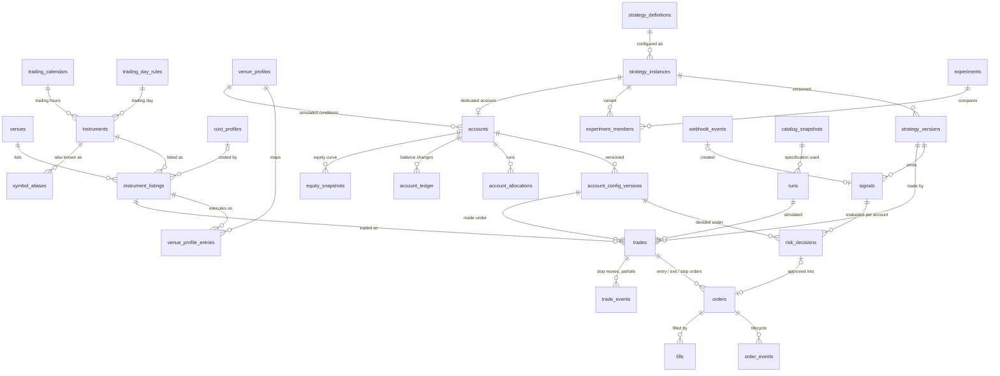

# 4. Database Schema (PostgreSQL 16)

This is the production schema built in Phase 2. Its executable form is the
SQLAlchemy 2.0 models in `kterminal/db/models.py`; the database is created by
one hand-reviewed Alembic migration,
`kterminal/db/migrations/versions/0001_phase2_schema.py`, and
`kterminal.db.migrate.check()` proves that the live database and the models
match (the integration tests require it to report no differences after an
upgrade). The SQL below is rendered from the models.

Conventions:

* Primary keys are **UUIDv7 generated in Python** (`kterminal.core.ids.uuid7`):
  the application knows a row's id before writing it, so a whole chain
  (signal → decision → order → fill → trade → ledger) can be built in memory
  and written in one transaction, and time-ordered ids keep indexes compact.
  Configuration objects are keyed by their human-readable slug instead:
  `venues.id`, `instruments.symbol`, `strategy_definitions.id`,
  `strategy_instances.id` (the `strategy_id` every metric is keyed on),
  `experiments.id`. Append-only streams use sequences (`account_ledger.seq`,
  `audit_log.seq`, `outbox.id`).
* Every timestamp is `timestamptz` in UTC. The model type `UTCDateTime`
  rejects naive datetimes before they reach the database.
* Prices and quantities are `NUMERIC(24,10)`; money is `NUMERIC(20,4)` in the
  account (or listing quote) currency; percentages are `NUMERIC(8,4)`. Never
  `float`.
* Enumerations are `text` + `CHECK` constraints (easier to evolve than
  Postgres `ENUM` types). The allowed values are taken from the Python enums
  (`kterminal.core.enums`, `kterminal.domain.instruments`,
  `kterminal.domain.costs.Liquidity`); the few without an enum in a lower layer
  (order status, time in force) are listed in `kterminal.db.models` and a
  test asserts they match `kterminal.brokers.base`.
* `jsonb` holds *snapshots* (the exact config/state a decision used), never
  data that must be queried relationally.
* `correlation_id` is propagated from the first event (webhook request or
  closed bar) through every row it causes.
* Constraint and index names are **stable**, derived by a naming convention:
  `pk_<table>`, `fk_<table>_<columns>`, `uq_<table>_<columns>`,
  `ck_<table>_<name>`, `ix_<table>_<columns>` — identical in every
  environment, so later migrations can address them by name.
* **The lab's isolation is enforced by the database**, not only by code. A
  signal's or trade's `strategy_version_id` must belong to *its*
  `strategy_instance_id`, a version must belong to its instance's definition,
  and a risk decision's or trade's `account_config_version_id` must belong to
  *its* `account_id` — composite foreign keys onto `UNIQUE (owner_id, id)`.
  Each instance has at most one dedicated account
  (`accounts.strategy_instance_id` is unique).
* Nothing is deleted implicitly: there is no `ON DELETE CASCADE`. Reference
  rows that history points at are disabled, never deleted (see §4.2).
* High-volume tables (`webhook_events`, `order_events`, `equity_snapshots`,
  `candles`, `audit_log`) are range-partitioned by month from day one, with a
  `DEFAULT` partition so no row is ever rejected (§4.10). Their primary keys
  include the partition key, and no foreign key points *at* them.
* Repositories (`kterminal.db.repositories`) never commit: the caller owns the
  transaction, so a unit of work happens completely or not at all.

## 4.1 Entity-relationship overview



## 4.2 Reference data: the instrument catalog

The catalog of [docs/11](11-instruments-sessions-costs.md) — instruments,
venues, venue-specific listings, aliases, trading calendars, trading-day
rules, session windows, cost profiles and venue profiles — lives in YAML and
is written to these tables by
`kterminal.db.repositories.catalog.apply_catalog(session, document,
fingerprint, applied_by)`:

* everything in the document is upserted; rows that did not change are not
  touched, so `updated_at` means "last changed";
* aliases and venue-profile entries no longer in the document are deleted;
* venues, instruments, listings, calendars, rules, windows, cost profiles and
  venue profiles no longer in the document are deleted only if nothing
  references them, otherwise **disabled** (`enabled = false`; listings also
  `tradable = false`), so signals, trades, orders and accounts that point at
  them stay valid; re-applying a catalog that defines them re-enables them;
* each distinct document is stored once in `catalog_snapshots` under its
  fingerprint. Re-applying an existing fingerprint only bumps
  `last_applied_at`; `latest_catalog_snapshot()` returns the catalog applied
  most recently. Signals, risk decisions, trades and runs record the
  `catalog_snapshot_id` they were sized and costed with.

`session_windows.classification_rank` is the window's position in the
ordered `session_classification` list (NULL = not used for labelling trades).
Calendar and cost-profile definitions are stored whole as `jsonb`; their
structure is validated by `kterminal.domain.sessions` and
`kterminal.domain.costs` before they get here.

```sql
CREATE TABLE catalog_snapshots (
    id                uuid PRIMARY KEY,
    fingerprint       text NOT NULL UNIQUE,
    document          jsonb NOT NULL,
    applied_at        timestamptz NOT NULL DEFAULT now(),  -- first time this fingerprint was applied
    applied_by        text NOT NULL,
    last_applied_at   timestamptz NOT NULL DEFAULT now()  -- most recent application (re-applies update it)
);

CREATE TABLE trading_day_rules (
    id                text PRIMARY KEY,
    timezone          text NOT NULL,
    rollover          time NOT NULL,                     -- local wall-clock time in timezone
    description       text NOT NULL DEFAULT '',
    enabled           boolean NOT NULL DEFAULT true,
    updated_at        timestamptz NOT NULL DEFAULT now()
);

CREATE TABLE trading_calendars (
    id                text PRIMARY KEY,
    timezone          text NOT NULL,
    definition        jsonb NOT NULL,                    -- TradingCalendar.to_dict(): weekly intervals, holidays, …
    description       text NOT NULL DEFAULT '',
    enabled           boolean NOT NULL DEFAULT true,
    updated_at        timestamptz NOT NULL DEFAULT now()
);

CREATE TABLE session_windows (
    id                text PRIMARY KEY,
    name              text NOT NULL,
    timezone          text NOT NULL,
    start_time        time NOT NULL,                     -- local wall-clock times in timezone
    end_time          time NOT NULL,                     -- end <= start: the window crosses local midnight
    days              text[] NOT NULL,                   -- local weekdays on which the window starts
    description       text NOT NULL DEFAULT '',
    classification_rank integer,                         -- position in session_classification, if any
    enabled           boolean NOT NULL DEFAULT true,
    updated_at        timestamptz NOT NULL DEFAULT now(),
    CHECK (classification_rank >= 0),
    CHECK (cardinality(days) > 0
          AND days <@ ARRAY['MON', 'TUE', 'WED', 'THU', 'FRI', 'SAT', 'SUN']::text[])
);

CREATE TABLE cost_profiles (
    id                text PRIMARY KEY,
    description       text NOT NULL DEFAULT '',
    definition        jsonb NOT NULL,                    -- spread / commission / slippage / funding / swap models
    enabled           boolean NOT NULL DEFAULT true,
    updated_at        timestamptz NOT NULL DEFAULT now()
);

CREATE TABLE venues (
    id                text PRIMARY KEY,
    name              text NOT NULL,
    kind              text NOT NULL,
    platform          text,
    timezone          text NOT NULL DEFAULT 'UTC',
    symbol_suffixes   text[] NOT NULL DEFAULT '{}'::text[],
    description       text NOT NULL DEFAULT '',
    enabled           boolean NOT NULL DEFAULT true,
    updated_at        timestamptz NOT NULL DEFAULT now(),
    CHECK (platform IN ('MT5', 'MT4', 'TRADELOCKER', 'CTRADER', 'DXTRADE', 'MATCH_TRADER',
              'TRADOVATE', 'RITHMIC', 'PROJECTX', 'NINJATRADER', 'INTERACTIVE_BROKERS',
              'OANDA_V20', 'CME_GLOBEX', 'BINANCE', 'BYBIT', 'OKX', 'HYPERLIQUID', 'COINBASE',
              'TRADINGVIEW', 'INTERNAL')),
    CHECK (kind IN ('EXCHANGE', 'BROKER', 'PROP_FIRM', 'DATA_FEED', 'SIGNAL_SOURCE', 'SIMULATOR'))
);

CREATE TABLE instruments (
    symbol            text PRIMARY KEY,                  -- canonical, e.g. XAUUSD, MNQ
    name              text NOT NULL,
    asset_class       text NOT NULL,
    base              text NOT NULL,
    quote_currency    text NOT NULL,
    tick_size         numeric(24,10) NOT NULL,           -- canonical rounding of strategy prices
    trading_hours     text NOT NULL REFERENCES trading_calendars(id),
    trading_day       text NOT NULL REFERENCES trading_day_rules(id),
    underlying        text NOT NULL DEFAULT '',
    futures           jsonb,                             -- contract cycle for exchange-traded futures
    description       text NOT NULL DEFAULT '',
    tags              text[] NOT NULL DEFAULT '{}'::text[],
    enabled           boolean NOT NULL DEFAULT true,
    updated_at        timestamptz NOT NULL DEFAULT now(),
    CHECK (tick_size > 0),
    CHECK (asset_class IN ('FX', 'METAL', 'INDEX', 'EQUITY', 'COMMODITY', 'CRYPTO', 'RATES'))
);

CREATE TABLE instrument_listings (
    venue             text NOT NULL REFERENCES venues(id),
    instrument        text NOT NULL REFERENCES instruments(symbol),
    venue_symbol      text NOT NULL,
    contract_type     text NOT NULL CHECK (contract_type IN ('SPOT', 'CFD', 'FUTURE',
              'PERPETUAL', 'INDEX_DATA')),
    tick_size         numeric(24,10) NOT NULL,
    contract_size     numeric(24,10) NOT NULL,           -- quote-ccy value of a 1.0 price move for 1.0 quantity
    quantity_unit     text NOT NULL CHECK (quantity_unit IN ('LOTS', 'CONTRACTS', 'BASE_UNITS')),
    min_qty           numeric(24,10) NOT NULL,
    qty_step          numeric(24,10) NOT NULL,
    max_qty           numeric(24,10),
    min_notional      numeric(20,4),
    quote_currency    text NOT NULL,
    pnl_model         text NOT NULL DEFAULT 'LINEAR' CHECK (pnl_model IN ('LINEAR', 'INVERSE')),
    trading_hours     text REFERENCES trading_calendars(id),
    cost_profile      text REFERENCES cost_profiles(id),
    symbol_format     text,                              -- futures: dated-symbol template, e.g. {root}{code}{y1}
    tradable          boolean NOT NULL DEFAULT true,
    enabled           boolean NOT NULL DEFAULT true,
    aliases           text[] NOT NULL DEFAULT '{}'::text[],
    verified_on       date,
    source            text NOT NULL DEFAULT '',
    notes             text NOT NULL DEFAULT '',
    updated_at        timestamptz NOT NULL DEFAULT now(),
    PRIMARY KEY (venue, instrument),
    CHECK (max_qty IS NULL OR max_qty >= min_qty),
    CHECK (tick_size > 0 AND contract_size > 0 AND min_qty > 0 AND qty_step > 0),
    CHECK (min_notional IS NULL OR min_notional >= 0),
    UNIQUE (venue, venue_symbol)
);

CREATE TABLE symbol_aliases (
    source            text NOT NULL,
    alias             text NOT NULL,
    instrument        text NOT NULL REFERENCES instruments(symbol),
    PRIMARY KEY (source, alias)
);
CREATE INDEX ix_symbol_aliases_instrument ON symbol_aliases (instrument);

CREATE TABLE venue_profiles (
    id                text PRIMARY KEY,
    description       text NOT NULL DEFAULT '',
    enabled           boolean NOT NULL DEFAULT true,
    updated_at        timestamptz NOT NULL DEFAULT now()
);

CREATE TABLE venue_profile_entries (
    venue_profile_id  text NOT NULL REFERENCES venue_profiles(id),
    instrument        text NOT NULL REFERENCES instruments(symbol),
    execution_venue   text NOT NULL,
    data_venue        text,
    PRIMARY KEY (venue_profile_id, instrument),
    FOREIGN KEY (data_venue, instrument) REFERENCES instrument_listings (venue, instrument),
    FOREIGN KEY (execution_venue, instrument) REFERENCES instrument_listings (venue, instrument)
);
```

## 4.3 Strategies, experiments & runs

[docs/12](12-strategy-lab.md) §12.1: a **definition** (code or a declared
TradingView script) is configured into **instances** (independently measured
lab subjects, the `strategy_id`); everything that determines an instance's
signals is frozen into an immutable **version** identified per instance by
its `config_hash`. `get_or_create_version()` re-uses the version when the
configuration hash is already known and otherwise creates one; either way it
becomes the instance's `current_version_id`. Rows recorded under an old
version keep pointing at it, so editing parameters or code never corrupts
historical comparisons, and metrics can be grouped per instance or per
version.

An instance id can never be re-pointed at another definition, and its
`status` changes only through `set_instance_status()`, which records a
`strategy_promotions` row with the evidence (re-applying the lab
configuration never demotes a strategy).

Experiment variants (*A*, *A + EMA filter*, *A + B confirmation* …) are
**separate instances** with their own accounts and metrics; an experiment
groups them under one set of conditions. `runs` (backtest, lab simulation,
forward test, signal replay) replaces Phase 1's `backtest_runs`; signals,
decisions, orders, fills, trades, ledger entries and equity snapshots carry an
optional `run_id`.

```sql
CREATE TABLE strategy_definitions (
    id                text PRIMARY KEY,                  -- definition slug, e.g. ema_cross
    name              text NOT NULL,
    kind              text NOT NULL CHECK (kind IN ('INTERNAL', 'EXTERNAL')),
    latest_version    text NOT NULL,                     -- semantic version declared by the plug-in / script
    module            text,                              -- Python module of an INTERNAL plug-in
    description       text NOT NULL DEFAULT '',
    meta              jsonb NOT NULL DEFAULT '{}'::jsonb,
    created_at        timestamptz NOT NULL DEFAULT now(),
    updated_at        timestamptz NOT NULL DEFAULT now()
);

CREATE TABLE strategy_instances (
    id                text PRIMARY KEY,                  -- instance slug, immutable
    definition_id     text NOT NULL REFERENCES strategy_definitions(id),
    name              text NOT NULL,
    description       text NOT NULL DEFAULT '',
    status            text NOT NULL DEFAULT 'DRAFT',
    enabled           boolean NOT NULL DEFAULT true,
    current_version_id uuid,
    tags              text[] NOT NULL DEFAULT '{}'::text[],
    webhook_secret_hashes jsonb NOT NULL DEFAULT '[]'::jsonb,  -- [{hash, created_at, expires_at}] — rotation for EXTERNAL (TradingView) instances
    created_at        timestamptz NOT NULL DEFAULT now(),
    updated_at        timestamptz NOT NULL DEFAULT now(),
    CHECK (status IN ('DRAFT', 'BACKTESTED', 'PAPER', 'DEMO', 'LIVE_APPROVED', 'RETIRED')),
    UNIQUE (id, definition_id),
    FOREIGN KEY (id, current_version_id) REFERENCES strategy_versions (instance_id, id)  -- added once both tables exist (reference cycle)
);
CREATE INDEX ix_strategy_instances_definition_id ON strategy_instances (definition_id);

CREATE TABLE strategy_versions (
    id                uuid PRIMARY KEY,
    instance_id       text NOT NULL REFERENCES strategy_instances(id),
    definition_id     text NOT NULL REFERENCES strategy_definitions(id),
    definition_version text NOT NULL,
    code_hash         text,                              -- sha256 of the plug-in source / Pine script
    params            jsonb NOT NULL DEFAULT '{}'::jsonb,
    params_hash       text NOT NULL,
    config            jsonb NOT NULL,                    -- the full version document (params, instruments, timeframes, …)
    config_hash       text NOT NULL,                     -- stamped on every signal as strategy_version
    framework_fingerprint text,
    kterminal_version text,
    created_at        timestamptz NOT NULL DEFAULT now(),
    UNIQUE (instance_id, id),
    UNIQUE (instance_id, config_hash),
    FOREIGN KEY (instance_id, definition_id) REFERENCES strategy_instances (id, definition_id)
);

CREATE TABLE strategy_promotions (
    id                uuid PRIMARY KEY,
    instance_id       text NOT NULL REFERENCES strategy_instances(id),
    strategy_version_id uuid REFERENCES strategy_versions(id),
    from_status       text NOT NULL,
    to_status         text NOT NULL,
    evidence          jsonb NOT NULL,                    -- metrics that satisfied the gate
    approved_by       uuid REFERENCES users(id),
    note              text NOT NULL DEFAULT '',
    created_at        timestamptz NOT NULL DEFAULT now(),
    CHECK (from_status IN ('DRAFT', 'BACKTESTED', 'PAPER', 'DEMO', 'LIVE_APPROVED', 'RETIRED')),
    CHECK (to_status IN ('DRAFT', 'BACKTESTED', 'PAPER', 'DEMO', 'LIVE_APPROVED', 'RETIRED'))
);
CREATE INDEX ix_strategy_promotions_instance_id ON strategy_promotions (instance_id);

CREATE TABLE experiments (
    id                text PRIMARY KEY,
    name              text NOT NULL,
    description       text NOT NULL DEFAULT '',
    status            text NOT NULL DEFAULT 'DRAFT' CHECK (status IN ('DRAFT', 'RUNNING',
              'COMPLETED', 'ARCHIVED')),
    conditions        jsonb NOT NULL DEFAULT '{}'::jsonb,  -- template, data window
    created_at        timestamptz NOT NULL DEFAULT now(),
    updated_at        timestamptz NOT NULL DEFAULT now()
);

CREATE TABLE experiment_members (
    experiment_id     text NOT NULL REFERENCES experiments(id),
    instance_id       text NOT NULL REFERENCES strategy_instances(id),
    label             text NOT NULL,                     -- 'A', 'A+EMA', 'A+B+LIQ'
    PRIMARY KEY (experiment_id, instance_id),
    UNIQUE (experiment_id, label)
);
CREATE INDEX ix_experiment_members_instance_id ON experiment_members (instance_id);

CREATE TABLE runs (
    id                uuid PRIMARY KEY,
    kind              text NOT NULL CHECK (kind IN ('BACKTEST', 'LAB_SIMULATION', 'FORWARD',
              'SIGNAL_REPLAY')),
    name              text NOT NULL DEFAULT '',
    experiment_id     text REFERENCES experiments(id),
    config            jsonb NOT NULL,                    -- instruments, timeframes, range, fill model, account template …
    data_fingerprint  jsonb NOT NULL DEFAULT '{}'::jsonb,
    catalog_snapshot_id uuid REFERENCES catalog_snapshots(id),
    status            text NOT NULL DEFAULT 'QUEUED' CHECK (status IN ('QUEUED', 'RUNNING',
              'COMPLETED', 'FAILED', 'CANCELLED')),
    created_at        timestamptz NOT NULL DEFAULT now(),
    started_at        timestamptz,
    finished_at       timestamptz,
    summary           jsonb,                             -- headline metrics (trades stay the source of truth)
    error             text,
    CHECK (finished_at IS NULL OR started_at IS NULL OR finished_at >= started_at)
);
CREATE INDEX ix_runs_experiment_id ON runs (experiment_id);
```

## 4.4 Accounts & risk configuration

Every strategy instance gets its **own** account —
`provision_dedicated_account()` creates `Paper 50K · <strategy_id>` with a
configurable starting balance (default **$50,000**), a `DEPOSIT` ledger entry,
an allocation to the instance and configuration version 1. It is idempotent:
re-provisioning with a changed configuration adds an
`account_config_versions` row (or re-activates an older one with the same
hash) and makes it current. The starting balance and currency may change only
while the account has no trades (booked as a `RESET` entry); afterwards that
would rewrite history and is refused. `LIVE` accounts are refused by the
repository, and the `CHECK (mode <> 'LIVE' OR live_enabled_by IS NOT NULL)`
makes it impossible to create or flip one without a named enabling user.

The ledger is the **only** way balances change; `seq` (an identity column the
application cannot set) orders entries that share a timestamp, and the
current balance is the `balance_after` of the highest `seq`. Lab risk
settings (risk %, max open positions, venue profile …) live in the account
configuration version; `risk_profiles` holds reusable rule sets such as a
prop-firm challenge's limits and is optional per account.

```sql
CREATE TABLE risk_profiles (
    id                uuid PRIMARY KEY,
    name              text NOT NULL,
    version           integer NOT NULL,
    config            jsonb NOT NULL,
    created_at        timestamptz NOT NULL DEFAULT now(),
    CHECK (version >= 1),
    UNIQUE (name, version)
);

CREATE TABLE accounts (
    id                uuid PRIMARY KEY,
    name              text NOT NULL UNIQUE,              -- 'Paper 50K · ema_cross_9_21_xau'
    mode              text NOT NULL CHECK (mode IN ('BACKTEST', 'PAPER', 'DEMO', 'LIVE')),
    broker            text NOT NULL,                     -- registered adapter name: 'paper', 'mt5_bridge', 'tradelocker', …
    venue_profile_id  text NOT NULL REFERENCES venue_profiles(id),
    risk_profile_id   uuid REFERENCES risk_profiles(id),
    currency          text NOT NULL DEFAULT 'USD',
    starting_balance  numeric(20,4) NOT NULL,
    status            text NOT NULL DEFAULT 'ACTIVE',
    strategy_instance_id text UNIQUE REFERENCES strategy_instances(id),
    current_config_version_id uuid,
    high_water_mark   numeric(20,4) NOT NULL,
    broker_account_ref text,                             -- external account id (masked in UI/logs)
    live_enabled_by   uuid REFERENCES users(id),
    live_enabled_at   timestamptz,
    created_at        timestamptz NOT NULL DEFAULT now(),
    updated_at        timestamptz NOT NULL DEFAULT now(),
    CHECK (starting_balance > 0),
    CHECK (status IN ('ACTIVE', 'LOCKED_FOR_DAY', 'BREACHED', 'PASSED', 'PAUSED', 'CLOSED')),
    CHECK (mode <> 'LIVE' OR live_enabled_by IS NOT NULL),
    CHECK (live_enabled_by IS NULL OR live_enabled_at IS NOT NULL),
    FOREIGN KEY (id, current_config_version_id) REFERENCES account_config_versions (account_id, id)  -- added once both tables exist (reference cycle)
);

CREATE TABLE account_config_versions (
    id                uuid PRIMARY KEY,
    account_id        uuid NOT NULL REFERENCES accounts(id),
    version           integer NOT NULL,
    config            jsonb NOT NULL,
    config_hash       text NOT NULL,
    created_at        timestamptz NOT NULL DEFAULT now(),
    CHECK (version >= 1),
    UNIQUE (account_id, config_hash),
    UNIQUE (account_id, id),
    UNIQUE (account_id, version)
);

CREATE TABLE account_allocations (
    account_id        uuid NOT NULL REFERENCES accounts(id),
    instance_id       text NOT NULL REFERENCES strategy_instances(id),
    enabled           boolean NOT NULL DEFAULT true,
    risk_multiplier   numeric(6,4) NOT NULL DEFAULT 1,
    created_at        timestamptz NOT NULL DEFAULT now(),
    PRIMARY KEY (account_id, instance_id),
    CHECK (risk_multiplier > 0 AND risk_multiplier <= 1)
);
CREATE INDEX ix_account_allocations_instance_id ON account_allocations (instance_id);

CREATE TABLE account_ledger (
    id                uuid PRIMARY KEY,
    seq               bigint GENERATED ALWAYS AS IDENTITY UNIQUE,
    account_id        uuid NOT NULL REFERENCES accounts(id),
    ts                timestamptz NOT NULL,
    kind              text NOT NULL,
    amount            numeric(20,4) NOT NULL,            -- signed change of the balance
    balance_after     numeric(20,4) NOT NULL,
    trade_id          uuid REFERENCES trades(id),
    fill_id           uuid REFERENCES fills(id),
    run_id            uuid REFERENCES runs(id),
    note              text NOT NULL DEFAULT '',
    CHECK (kind IN ('DEPOSIT', 'REALIZED_PNL', 'COMMISSION', 'SWAP', 'FUNDING', 'ADJUSTMENT',
              'RESET'))
);
CREATE INDEX ix_account_ledger_account_id_seq ON account_ledger (account_id, seq);
CREATE INDEX ix_account_ledger_run_id ON account_ledger (run_id) WHERE run_id IS NOT NULL;
CREATE INDEX ix_account_ledger_trade_id ON account_ledger (trade_id) WHERE trade_id IS NOT NULL;

CREATE TABLE equity_snapshots (
    account_id        uuid NOT NULL REFERENCES accounts(id),
    ts                timestamptz NOT NULL,
    balance           numeric(20,4) NOT NULL,
    equity            numeric(20,4) NOT NULL,
    open_pnl          numeric(20,4) NOT NULL,
    open_risk         numeric(20,4) NOT NULL,            -- Σ distance-to-stop × size
    daily_pnl         numeric(20,4) NOT NULL,            -- vs. the trading-day start
    drawdown          numeric(20,4) NOT NULL,            -- vs. the high-water mark
    high_water_mark   numeric(20,4) NOT NULL,
    run_id            uuid REFERENCES runs(id),
    PRIMARY KEY (account_id, ts)
) PARTITION BY RANGE (ts);
CREATE INDEX ix_equity_snapshots_run_id ON equity_snapshots (run_id) WHERE run_id IS NOT NULL;
```

## 4.5 Signals & webhooks

Every webhook request is logged in `webhook_events` (accepted or not, with
the secret removed before storage); `strategy_instance_id` is what the
payload claimed and is deliberately not a foreign key, so requests for unknown
strategies are recorded too. A signal that violates the standard is still
stored with `status = 'INVALID'`, its `reject_code` and the `raw_payload`;
only such a signal may lack a version, instrument, timeframe or action.

```sql
CREATE TABLE webhook_events (
    id                uuid NOT NULL,
    received_at       timestamptz NOT NULL,
    source_ip         inet NOT NULL,
    user_agent        text,
    content_type      text,
    body_redacted     jsonb,
    body_sha256       text NOT NULL,
    strategy_instance_id text,                           -- as claimed by the payload; unknown ids included
    status            text NOT NULL CHECK (status IN ('ACCEPTED', 'DUPLICATE', 'REJECTED', 'TEST')),
    reject_code       text,                              -- AUTH_FAILED, STALE_TIMESTAMP, UNKNOWN_SYMBOL, …
    reject_detail     text,
    signal_id         uuid,
    processing_ms     integer NOT NULL,
    correlation_id    uuid NOT NULL,
    PRIMARY KEY (id, received_at),
    CHECK (processing_ms >= 0)
) PARTITION BY RANGE (received_at);
CREATE INDEX ix_webhook_events_signal_id ON webhook_events (signal_id) WHERE signal_id IS NOT NULL;
CREATE INDEX ix_webhook_events_strategy_instance_id_received_at ON webhook_events (strategy_instance_id, received_at);

CREATE TABLE signals (
    id                uuid PRIMARY KEY,
    strategy_instance_id text NOT NULL REFERENCES strategy_instances(id),
    strategy_version_id uuid,
    definition_id     text NOT NULL REFERENCES strategy_definitions(id),
    source            text NOT NULL CHECK (source IN ('INTERNAL', 'TRADINGVIEW', 'MANUAL',
              'REPLAY')),
    run_id            uuid REFERENCES runs(id),
    instrument        text REFERENCES instruments(symbol),
    raw_symbol        text,                              -- as received (e.g. BINANCE:NEARUSDT.P)
    timeframe         text,                              -- canonical: 1m, 5m, 15m, 1h, 1D
    bar_time          timestamptz,                       -- open time of the evaluated bar
    signal_time       timestamptz NOT NULL,              -- decision time: close of the evaluated bar
    received_at       timestamptz NOT NULL,              -- when the terminal got it
    action            text,
    order_type        text NOT NULL DEFAULT 'MARKET' CHECK (order_type IN ('MARKET', 'LIMIT',
              'STOP')),
    entry             numeric(24,10),
    stop_loss         numeric(24,10),
    take_profit       numeric(24,10),
    risk_pct          numeric(8,4),                      -- requested risk; capped by the account configuration
    confidence        numeric(5,4),
    metadata          jsonb NOT NULL DEFAULT '{}'::jsonb,
    market_snapshot   jsonb NOT NULL DEFAULT '{}'::jsonb,
    raw_payload       jsonb NOT NULL DEFAULT '{}'::jsonb,  -- INVALID: as received
    idempotency_key   text NOT NULL UNIQUE,
    status            text NOT NULL DEFAULT 'RECEIVED' CHECK (status IN ('RECEIVED', 'ROUTED',
              'IGNORED', 'INVALID', 'EXPIRED')),
    reject_code       text,
    reject_detail     text,
    catalog_snapshot_id uuid REFERENCES catalog_snapshots(id),
    correlation_id    uuid NOT NULL,
    CHECK (status = 'INVALID' OR (strategy_version_id IS NOT NULL AND instrument IS NOT NULL
          AND timeframe IS NOT NULL AND action IS NOT NULL)),
    CHECK (risk_pct > 0 AND risk_pct <= 100),
    CHECK (confidence >= 0 AND confidence <= 1),
    CHECK (action IN ('LONG', 'SHORT', 'EXIT_LONG', 'EXIT_SHORT', 'MOVE_SL', 'NO_TRADE')),
    FOREIGN KEY (strategy_instance_id, definition_id) REFERENCES strategy_instances (id, definition_id),
    FOREIGN KEY (strategy_instance_id, strategy_version_id) REFERENCES strategy_versions (instance_id, id)
);
CREATE INDEX ix_signals_run_id ON signals (run_id) WHERE run_id IS NOT NULL;
CREATE INDEX ix_signals_strategy_instance_id_signal_time ON signals (strategy_instance_id, signal_time);
CREATE INDEX ix_signals_strategy_version_id ON signals (strategy_version_id);
```

`NO_TRADE` signals are not persisted by default (one per bar would swamp the
table); a strategy can mark one as `persist=True` when the *reason* is worth
analysing (e.g. "filtered by news window").

## 4.6 Risk

A risk decision records, for one signal on one account, every rule's result,
the account state and quote it used, and the `account_config_version_id` it
was made under (which must belong to that account).

```sql
CREATE TABLE risk_decisions (
    id                uuid PRIMARY KEY,
    signal_id         uuid NOT NULL REFERENCES signals(id),
    account_id        uuid NOT NULL REFERENCES accounts(id),
    account_config_version_id uuid NOT NULL,
    decided_at        timestamptz NOT NULL,
    approved          boolean NOT NULL,
    primary_reason    text,                              -- first failing rule code; NULL when approved
    rule_results      jsonb NOT NULL,                    -- every rule: passed, code, values
    account_state     jsonb NOT NULL,                    -- balance, equity, daily P&L, DD, open positions
    risk_profile_id   uuid REFERENCES risk_profiles(id),
    quote             jsonb NOT NULL DEFAULT '{}'::jsonb,  -- bid/ask/ts used for sizing
    requested_qty     numeric(24,10),
    approved_qty      numeric(24,10),
    risk_amount       numeric(20,4),
    risk_pct          numeric(8,4),
    expires_at        timestamptz,
    catalog_snapshot_id uuid REFERENCES catalog_snapshots(id),
    run_id            uuid REFERENCES runs(id),
    correlation_id    uuid NOT NULL,
    CHECK (approved OR primary_reason IS NOT NULL),
    UNIQUE (signal_id, account_id),
    FOREIGN KEY (account_id, account_config_version_id) REFERENCES account_config_versions (account_id, id)
);
CREATE INDEX ix_risk_decisions_account_id_decided_at ON risk_decisions (account_id, decided_at);
CREATE INDEX ix_risk_decisions_run_id ON risk_decisions (run_id) WHERE run_id IS NOT NULL;

CREATE TABLE risk_events (
    id                uuid PRIMARY KEY,
    ts                timestamptz NOT NULL,
    account_id        uuid REFERENCES accounts(id),
    strategy_instance_id text REFERENCES strategy_instances(id),
    kind              text NOT NULL,
    severity          text NOT NULL CHECK (severity IN ('INFO', 'WARNING', 'CRITICAL')),
    threshold         numeric(8,4),                      -- e.g. 0.75 = 75 % of the limit consumed
    details           jsonb NOT NULL DEFAULT '{}'::jsonb,
    run_id            uuid REFERENCES runs(id),
    correlation_id    uuid
);
CREATE INDEX ix_risk_events_account_id_ts ON risk_events (account_id, ts);

CREATE TABLE kill_switches (
    scope             text NOT NULL CHECK (scope IN ('GLOBAL', 'ACCOUNT', 'STRATEGY')),
    scope_id          text NOT NULL DEFAULT '*',
    active            boolean NOT NULL,
    close_positions   boolean NOT NULL DEFAULT false,
    cancel_orders     boolean NOT NULL DEFAULT true,
    reason            text NOT NULL,
    changed_by        text NOT NULL,                     -- user id, 'system:<rule>' or 'telegram:<user>'
    changed_at        timestamptz NOT NULL,
    PRIMARY KEY (scope, scope_id)
);
```

## 4.7 Orders, fills & trades

A trade is one round trip and the unit every metric is computed from. It
records its instance **and** version, its account **and** account
configuration version, the listing it was executed on (`venue`,
`instrument` → `instrument_listings`) with the `venue_symbol` used, and its
costs separately: commission, spread cost, swap and funding. A closed trade
must have an exit price, time, reason and net P&L. Any `ENTRY` order must
reference an approved risk decision.

```sql
CREATE TABLE trades (
    id                uuid PRIMARY KEY,
    account_id        uuid NOT NULL REFERENCES accounts(id),
    account_config_version_id uuid NOT NULL,
    strategy_instance_id text NOT NULL REFERENCES strategy_instances(id),
    strategy_version_id uuid NOT NULL,
    entry_signal_id   uuid NOT NULL REFERENCES signals(id),
    exit_signal_id    uuid REFERENCES signals(id),
    run_id            uuid REFERENCES runs(id),
    catalog_snapshot_id uuid REFERENCES catalog_snapshots(id),
    mode              text NOT NULL CHECK (mode IN ('BACKTEST', 'PAPER', 'DEMO', 'LIVE')),
    instrument        text NOT NULL,
    venue             text NOT NULL,
    venue_symbol      text NOT NULL,
    timeframe         text NOT NULL,
    direction         text NOT NULL CHECK (direction IN ('LONG', 'SHORT')),
    qty               numeric(24,10) NOT NULL,
    entry_requested   numeric(24,10) NOT NULL,
    entry_price       numeric(24,10) NOT NULL,           -- average fill
    entry_time        timestamptz NOT NULL,
    initial_stop      numeric(24,10) NOT NULL,
    initial_target    numeric(24,10),
    current_stop      numeric(24,10),
    current_target    numeric(24,10),
    exit_price        numeric(24,10),
    exit_time         timestamptz,
    exit_reason       text,
    initial_risk      numeric(20,4) NOT NULL,            -- |entry_price − initial_stop| × qty × point value
    gross_pnl         numeric(20,4),
    commission        numeric(20,4) NOT NULL DEFAULT 0,
    swap              numeric(20,4) NOT NULL DEFAULT 0,
    funding           numeric(20,4) NOT NULL DEFAULT 0,
    spread_cost       numeric(20,4) NOT NULL DEFAULT 0,
    net_pnl           numeric(20,4),
    r_multiple        numeric(10,4),                     -- net_pnl / initial_risk
    entry_slippage    numeric(24,10),                    -- adverse-positive, price units
    exit_slippage     numeric(24,10),
    mae               numeric(24,10),                    -- max adverse excursion (price)
    mfe               numeric(24,10),                    -- max favourable excursion (price)
    session           text,                              -- session classification at entry
    status            text NOT NULL CHECK (status IN ('OPEN', 'CLOSED')),
    correlation_id    uuid NOT NULL,
    created_at        timestamptz NOT NULL DEFAULT now(),
    updated_at        timestamptz NOT NULL DEFAULT now(),
    CHECK (qty > 0),
    CHECK (exit_reason IN ('TAKE_PROFIT', 'STOP_LOSS', 'BREAKEVEN_STOP', 'TRAILING_STOP',
              'SIGNAL_EXIT', 'REVERSAL', 'MANUAL', 'KILL_SWITCH', 'RISK_FLATTEN',
              'SESSION_CLOSE', 'BROKER_LIQUIDATION', 'RUN_END')),
    CHECK (exit_time IS NULL OR exit_time >= entry_time),
    CHECK (status = 'OPEN' OR (exit_price IS NOT NULL AND exit_time IS NOT NULL
          AND exit_reason IS NOT NULL AND net_pnl IS NOT NULL)),
    FOREIGN KEY (account_id, account_config_version_id) REFERENCES account_config_versions (account_id, id),
    FOREIGN KEY (strategy_instance_id, strategy_version_id) REFERENCES strategy_versions (instance_id, id),
    FOREIGN KEY (venue, instrument) REFERENCES instrument_listings (venue, instrument)
);
CREATE INDEX ix_trades_account_id_status ON trades (account_id, status);
CREATE INDEX ix_trades_run_id ON trades (run_id) WHERE run_id IS NOT NULL;
CREATE INDEX ix_trades_strategy_instance_id_exit_time ON trades (strategy_instance_id, exit_time);
CREATE INDEX ix_trades_strategy_version_id ON trades (strategy_version_id);

CREATE TABLE orders (
    id                uuid PRIMARY KEY,
    client_order_id   text NOT NULL UNIQUE,              -- idempotent submission
    broker_order_id   text,
    account_id        uuid NOT NULL REFERENCES accounts(id),
    strategy_instance_id text REFERENCES strategy_instances(id),
    trade_id          uuid REFERENCES trades(id),
    signal_id         uuid REFERENCES signals(id),
    risk_decision_id  uuid REFERENCES risk_decisions(id),
    parent_order_id   uuid REFERENCES orders(id),
    run_id            uuid REFERENCES runs(id),
    purpose           text NOT NULL CHECK (purpose IN ('ENTRY', 'STOP_LOSS', 'TAKE_PROFIT',
              'EXIT', 'FLATTEN')),
    mode              text NOT NULL CHECK (mode IN ('BACKTEST', 'PAPER', 'DEMO', 'LIVE')),
    venue             text NOT NULL,
    instrument        text NOT NULL,
    venue_symbol      text NOT NULL,
    side              text NOT NULL CHECK (side IN ('BUY', 'SELL')),
    order_type        text NOT NULL CHECK (order_type IN ('MARKET', 'LIMIT', 'STOP')),
    qty               numeric(24,10) NOT NULL,
    requested_price   numeric(24,10),                    -- reference / limit / stop price
    time_in_force     text NOT NULL DEFAULT 'GTC' CHECK (time_in_force IN ('GTC', 'DAY', 'IOC',
              'FOK')),
    status            text NOT NULL,
    filled_qty        numeric(24,10) NOT NULL DEFAULT 0,
    avg_fill_price    numeric(24,10),
    slippage          numeric(24,10),
    commission        numeric(20,4) NOT NULL DEFAULT 0,
    reject_reason     text,
    created_at        timestamptz NOT NULL,
    submitted_at      timestamptz,
    acknowledged_at   timestamptz,
    completed_at      timestamptz,
    correlation_id    uuid NOT NULL,
    CHECK (purpose <> 'ENTRY' OR risk_decision_id IS NOT NULL),
    CHECK (filled_qty >= 0 AND filled_qty <= qty),
    CHECK (qty > 0),
    CHECK (status IN ('PENDING_SUBMIT', 'SUBMITTED', 'ACCEPTED', 'PARTIALLY_FILLED', 'FILLED',
              'CANCELLED', 'REJECTED', 'EXPIRED', 'FAILED')),
    FOREIGN KEY (venue, instrument) REFERENCES instrument_listings (venue, instrument)
);
CREATE INDEX ix_orders_account_id_status ON orders (account_id, status);
CREATE INDEX ix_orders_run_id ON orders (run_id) WHERE run_id IS NOT NULL;
CREATE INDEX ix_orders_signal_id ON orders (signal_id) WHERE signal_id IS NOT NULL;
CREATE INDEX ix_orders_trade_id ON orders (trade_id) WHERE trade_id IS NOT NULL;

CREATE TABLE order_events (
    id                uuid NOT NULL,
    ts                timestamptz NOT NULL,
    order_id          uuid NOT NULL REFERENCES orders(id),
    from_status       text,
    to_status         text NOT NULL,
    broker_payload    jsonb,
    PRIMARY KEY (id, ts)
) PARTITION BY RANGE (ts);
CREATE INDEX ix_order_events_order_id_ts ON order_events (order_id, ts);

CREATE TABLE fills (
    id                uuid PRIMARY KEY,
    order_id          uuid NOT NULL REFERENCES orders(id),
    account_id        uuid NOT NULL REFERENCES accounts(id),
    broker_fill_id    text,
    ts                timestamptz NOT NULL,
    qty               numeric(24,10) NOT NULL,
    price             numeric(24,10) NOT NULL,
    commission        numeric(20,4) NOT NULL DEFAULT 0,
    liquidity         text CHECK (liquidity IN ('MAKER', 'TAKER')),
    spread_cost       numeric(20,4) NOT NULL DEFAULT 0,
    slippage          numeric(24,10) NOT NULL DEFAULT 0,  -- adverse-positive, price units
    run_id            uuid REFERENCES runs(id),
    CHECK (qty > 0 AND price > 0),
    UNIQUE (order_id, broker_fill_id)
);
CREATE INDEX ix_fills_account_id_ts ON fills (account_id, ts);
CREATE INDEX ix_fills_run_id ON fills (run_id) WHERE run_id IS NOT NULL;

CREATE TABLE trade_events (
    id                uuid PRIMARY KEY,
    trade_id          uuid NOT NULL REFERENCES trades(id),
    ts                timestamptz NOT NULL,
    kind              text NOT NULL,
    old_value         numeric(24,10),
    new_value         numeric(24,10),
    signal_id         uuid REFERENCES signals(id),
    details           jsonb NOT NULL DEFAULT '{}'::jsonb,
    CHECK (kind IN ('STOP_MOVED', 'BREAKEVEN', 'TARGET_MOVED', 'PARTIAL_CLOSE', 'NOTE'))
);
CREATE INDEX ix_trade_events_trade_id_ts ON trade_events (trade_id, ts);
```

Backtest runs store `trades` (with `run_id`) and an equity curve; individual
backtest orders/fills are only persisted when the run is configured with
`persist_orders=true` (debugging), which keeps large parameter sweeps cheap.

## 4.8 Analytics, market data, notifications, system & audit

`performance_metrics` is a cache — the recorded trades remain the source of
truth and every number can be recomputed from them.

```sql
CREATE TABLE performance_metrics (
    id                uuid PRIMARY KEY,
    scope             text NOT NULL,
    scope_id          text NOT NULL,
    mode              text NOT NULL CHECK (mode IN ('BACKTEST', 'PAPER', 'DEMO', 'LIVE')),
    dimension         text NOT NULL,
    bucket            text NOT NULL,                     -- 'XAUUSD', '2026-W41', 'LONG', …
    period_start      timestamptz,
    period_end        timestamptz,
    metrics           jsonb NOT NULL,                    -- appendix A definitions
    trade_count       integer NOT NULL,
    computed_at       timestamptz NOT NULL,
    CHECK (dimension IN ('ALL', 'SYMBOL', 'TIMEFRAME', 'SESSION', 'DAY', 'WEEK', 'MONTH',
              'DIRECTION')),
    CHECK (scope IN ('STRATEGY_INSTANCE', 'STRATEGY_VERSION', 'ACCOUNT', 'RUN', 'EXPERIMENT')),
    CHECK (trade_count >= 0),
    UNIQUE (scope, scope_id, mode, dimension, bucket)
);

CREATE TABLE candles (
    instrument        text NOT NULL,                     -- canonical symbol
    timeframe         text NOT NULL,
    source            text NOT NULL,                     -- data venue / provider
    ts                timestamptz NOT NULL,
    open              numeric(24,10) NOT NULL,
    high              numeric(24,10) NOT NULL,
    low               numeric(24,10) NOT NULL,
    close             numeric(24,10) NOT NULL,
    volume            numeric(24,10),
    PRIMARY KEY (instrument, timeframe, source, ts),
    CHECK (low <= open AND low <= close AND high >= open AND high >= close AND low <= high),
    CHECK (volume IS NULL OR volume >= 0)
) PARTITION BY RANGE (ts);
```

```sql
CREATE TABLE outbox (
    id                bigserial PRIMARY KEY,
    topic             text NOT NULL,                     -- 'signal.received', 'trade.opened', …
    payload           jsonb NOT NULL,
    created_at        timestamptz NOT NULL DEFAULT now(),
    available_at      timestamptz NOT NULL DEFAULT now(),
    attempts          integer NOT NULL DEFAULT 0,
    processed_at      timestamptz,
    last_error        text,
    correlation_id    uuid,
    CHECK (attempts >= 0)
);
CREATE INDEX ix_outbox_topic_available_at ON outbox (topic, available_at) WHERE processed_at IS NULL;

CREATE TABLE notifications (
    id                uuid PRIMARY KEY,
    channel           text NOT NULL DEFAULT 'telegram',
    destination       text NOT NULL,                     -- logical route ('trades', 'alerts', 'reports'), not a raw chat id
    event_type        text NOT NULL,
    dedupe_key        text,
    payload           jsonb NOT NULL,
    rendered_text     text NOT NULL,
    status            text NOT NULL CHECK (status IN ('PENDING', 'SENT', 'FAILED', 'SUPPRESSED')),
    attempts          integer NOT NULL DEFAULT 0,
    provider_message_id text,
    error             text,
    created_at        timestamptz NOT NULL,
    sent_at           timestamptz,
    correlation_id    uuid,
    UNIQUE (channel, dedupe_key)
);

CREATE TABLE report_runs (
    report            text NOT NULL,                     -- 'DAILY', 'WEEKLY'
    period_key        text NOT NULL,                     -- '2026-10-05', '2026-W41'
    status            text NOT NULL CHECK (status IN ('PENDING', 'SENT', 'FAILED', 'SKIPPED')),
    created_at        timestamptz NOT NULL,
    PRIMARY KEY (report, period_key)
);

CREATE TABLE system_errors (
    id                uuid PRIMARY KEY,
    ts                timestamptz NOT NULL,
    component         text NOT NULL,                     -- 'engine.execution', 'strategy.host', 'broker.mt5_bridge', …
    severity          text NOT NULL CHECK (severity IN ('WARNING', 'ERROR', 'CRITICAL')),
    message           text NOT NULL,
    exception         text,                              -- type + traceback (redacted)
    context           jsonb NOT NULL DEFAULT '{}'::jsonb,
    strategy_instance_id text REFERENCES strategy_instances(id),  -- strategy faults are attributed to their instance
    run_id            uuid REFERENCES runs(id),
    correlation_id    uuid
);
CREATE INDEX ix_system_errors_strategy_instance_id_ts ON system_errors (strategy_instance_id, ts) WHERE strategy_instance_id IS NOT NULL;
CREATE INDEX ix_system_errors_ts ON system_errors (ts);

CREATE TABLE system_state (
    key               text PRIMARY KEY,
    value             jsonb NOT NULL,
    updated_at        timestamptz NOT NULL
);

CREATE TABLE users (
    id                uuid PRIMARY KEY,
    username          text NOT NULL UNIQUE,
    password_hash     text NOT NULL,                     -- argon2id
    totp_secret_enc   bytea,                             -- encrypted with the app master key
    role              text NOT NULL CHECK (role IN ('VIEWER', 'OPERATOR', 'ADMIN')),
    disabled          boolean NOT NULL DEFAULT false,
    created_at        timestamptz NOT NULL DEFAULT now()
);

CREATE TABLE audit_log (
    seq               bigserial NOT NULL,
    ts                timestamptz NOT NULL,
    actor             text NOT NULL,                     -- 'user:<id>', 'system:engine', 'strategy:<id>', 'webhook'
    action            text NOT NULL,                     -- 'risk.decision', 'order.submit', 'killswitch.activate', …
    entity_type       text NOT NULL,
    entity_id         text NOT NULL,
    data              jsonb NOT NULL,
    correlation_id    uuid,
    prev_hash         text NOT NULL,
    hash              text NOT NULL,                     -- sha256(prev_hash || canonical_json(row))
    PRIMARY KEY (seq, ts)
) PARTITION BY RANGE (ts);
CREATE INDEX ix_audit_log_entity_type_entity_id ON audit_log (entity_type, entity_id);
```

The audit log is append-only and hash-chained
(`kterminal.db.audit`):

* `append()` takes a transaction-level advisory lock (so the chain stays
  linear with several writers), reads the last hash and inserts
  `hash = sha256(prev_hash || canonical_json({seq, ts, actor, action,
  entity_type, entity_id, data, correlation_id}))`; the first entry's
  `prev_hash` is 64 zeros. `data` is normalised through `jsonb` before
  hashing, so verification never trips on key order or number formatting.
* A trigger (`kt_audit_log_append_only`) rejects `UPDATE`/`DELETE` on every
  partition and `TRUNCATE` on the table and on each partition.
* `verify()` recomputes the chain in `seq` order and reports the first broken
  link (a modified, deleted or re-hashed entry).
* In production the application role should be granted only
  `INSERT, SELECT` on `audit_log` (roles are deployment configuration, not
  part of the migration).

## 4.9 The audit trail: explaining a trade

Every question in the brief maps to a column:

| Question | Where |
|---|---|
| Which strategy generated it? | `trades.strategy_instance_id` + `trades.strategy_version_id` → `strategy_versions` (definition version, code hash, params, full config) |
| Under which account settings? | `trades.account_config_version_id` → `account_config_versions.config` |
| With which instrument specification and costs? | `trades.venue`/`instrument` → `instrument_listings`; `trades.catalog_snapshot_id` → `catalog_snapshots.document` |
| When did the signal arrive? | `signals.received_at` (+ `webhook_events.received_at` for TradingView) |
| What market data was used? | `signals.market_snapshot`, `risk_decisions.quote`, `runs.data_fingerprint` |
| Did risk approve it, and why? | `risk_decisions.approved`, `.rule_results` (every rule), `.account_state` |
| Requested order parameters | `orders.qty`, `.requested_price`, `.order_type`, signal SL/TP |
| Actual execution parameters | `fills.*`, `orders.avg_fill_price`, `order_events.broker_payload` |
| Slippage and costs | `fills.slippage`, `fills.spread_cost`, `trades.entry_slippage`, `trades.exit_slippage`, `trades.commission`, `.spread_cost`, `.swap`, `.funding` |
| Final result / R multiple | `trades.net_pnl`, `trades.r_multiple` |
| Why did it exit? | `trades.exit_reason` + `trade_events` (stop moves) + exit `orders` |

```sql
-- "Explain trade :trade_id" — one query, one row per order/fill of its life
SELECT t.id, t.strategy_instance_id, sv.definition_id, sv.definition_version, sv.code_hash,
       sv.config_hash, sv.params, acv.version AS account_config_version,
       acv.config AS account_config, cs.fingerprint AS catalog_fingerprint,
       t.venue, t.venue_symbol,
       w.received_at AS webhook_at, w.source_ip, s.received_at AS signal_at, s.market_snapshot,
       rd.approved, rd.primary_reason, rd.rule_results, rd.account_state, rd.quote,
       o.purpose, o.order_type, o.qty, o.requested_price, o.avg_fill_price,
       f.ts AS filled_at, f.price AS fill_price, f.slippage, f.spread_cost, f.commission,
       t.exit_reason, t.net_pnl, t.r_multiple
FROM trades t
JOIN strategy_versions sv         ON sv.id = t.strategy_version_id
JOIN account_config_versions acv  ON acv.id = t.account_config_version_id
JOIN signals s                    ON s.id = t.entry_signal_id
LEFT JOIN catalog_snapshots cs    ON cs.id = t.catalog_snapshot_id
LEFT JOIN webhook_events w        ON w.signal_id = s.id
LEFT JOIN risk_decisions rd       ON rd.signal_id = s.id AND rd.account_id = t.account_id
LEFT JOIN orders o                ON o.trade_id = t.id
LEFT JOIN fills f                 ON f.order_id = o.id
WHERE t.id = :trade_id
ORDER BY o.created_at, f.ts;
```

The dashboard's *Trade History → trade detail* page renders exactly this.

## 4.10 Partitions, retention and migrations

Partitioned tables are created with a `DEFAULT` partition.
`kterminal.db.partitions.ensure_monthly_partitions(engine | connection |
session, today=…, months_back=1, months_ahead=3)` creates the missing monthly
partitions `<table>_pYYYYMM` (UTC months) for every table in
`PARTITIONED_TABLES`; it is idempotent, serialised by an advisory lock and run
by the worker at start-up and daily. Rows that already sit in the `DEFAULT`
partition for a month being created are moved into the new partition in the
same transaction — except audit-log rows, which are never moved
automatically. New audit-log partitions get their `TRUNCATE` guard.

Retention defaults: `webhook_events`, `order_events`, `candles` partitions
older than 18 months are archived to compressed Parquet then dropped;
`trades`, `signals`, `risk_decisions`, `orders`, `fills`, `account_ledger` and
`audit_log` are kept indefinitely.

Migrations are driven by `kterminal.db.migrate` (no `alembic.ini`; the
scripts ship inside the package as `kterminal.db:migrations`):

| Function | Does |
|---|---|
| `await upgrade(dsn, revision="head")` | apply migrations (one transaction, under an advisory lock) |
| `await downgrade(dsn, revision)` | revert; `"base"` removes the whole schema |
| `await current(dsn)` | the database's revision, or `None` |
| `await check(dsn)` | differences between the models (and newest revision) and the live database; `[]` when they match |

New revisions are autogenerated against a migrated database and then
hand-reviewed: Alembic does not see CHECK constraints, partitioning, triggers
or functions, and run-time partitions are excluded from the comparison.
