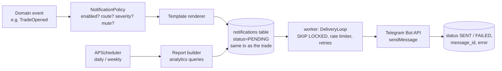

# 8. Telegram Architecture

## 8.1 Design goals

1. **Never on the trading path.** A Telegram outage, rate limit or bad token
   must not delay or block a trade. Notifications are written to a durable
   queue and delivered by the separate `worker` process.
2. **Never lose an important message.** Notifications are inserted in the
   *same transaction* as the state change that caused them (transactional
   outbox), so "trade opened" cannot be committed without its notification.
3. **Never spam.** Repeated warnings are de-duplicated, bursts are
   coalesced, and Telegram's rate limits are respected.
4. **Pluggable.** Telegram is one `Notifier` implementation; Discord, email
   or Slack can be added as separate plug-ins without changing producers.

## 8.2 Flow



## 8.3 Components

| Component | Responsibility |
|---|---|
| `Notifier` (port) | `async send(destination, text) -> DeliveryResult` |
| `TelegramNotifier` | httpx client for `sendMessage` (HTML parse mode, escaped content, link previews off); maps `429` → retry after `parameters.retry_after`; `5xx`/timeouts → exponential backoff (1 s → 5 min, max 8 attempts); `400`/`403` → permanent failure + system error |
| `NotificationPolicy` | Event type → enabled, destinations, severity, de-dupe key, quiet hours (critical events ignore quiet hours) |
| `TemplateRenderer` | One formatter per event type; prices rounded to the instrument's tick size, money to cents, percentages to 2 dp |
| `DeliveryLoop` | Pulls `PENDING` rows with `FOR UPDATE SKIP LOCKED`, applies a token-bucket limiter (≤ 1 msg/s per chat, ≤ 20 msg/min per group, ≤ 25 msg/s global) and coalesces bursts (e.g. 10 rejections in 10 s → one summary) |
| `ReportScheduler` | APScheduler cron jobs (timezone-aware); `report_runs` guarantees each period's report is sent once even after restarts |
| `CommandBot` (later, opt-in) | `/status`, `/positions`, `/pnl`, `/kill <reason>` via long polling; only allow-listed Telegram user IDs in allow-listed chats; `/kill` is allowed (risk-reducing) but resuming trading is **dashboard-only** |

Destinations are logical routes (`trades`, `alerts`, `reports`) mapped to
chat IDs in configuration, so e.g. critical alerts can go to a separate,
loud channel.

## 8.4 Events

| Event | Default route | Severity | De-dupe |
|---|---|---|---|
| Signal received | trades | info | per signal |
| Trade approved / Trade rejected (with reason) | trades | info / warning | per decision |
| Trade opened / closed | trades | info | per trade |
| Stop loss hit / Take profit hit | trades | info | per trade |
| Stop moved / Breakeven activated | trades | info | per trade event |
| Daily loss warning / Drawdown warning / Prop-rule warning | alerts | warning | per account × threshold × trading day |
| Connection failure / Webhook failure / Execution failure | alerts | critical | coalesced per component per 5 min |
| Kill switch activated / deactivated | alerts (+ all routes) | critical | per change |
| Daily report / Weekly report | reports | info | per period |

Each event type can be disabled, re-routed or muted per account/strategy
(e.g. mute "signal received" for a noisy strategy in backtest-like paper
runs).

## 8.5 Message formats

```
🟢 TRADE OPENED
Strategy: Breakout + Retest
Symbol: XAUUSD
Direction: LONG
Entry: 2678.40
SL: 2673.20
TP: 2704.40
Risk: 0.50%
RR: 1:5
Account: Paper 50K
```

```
🔴 TRADE CLOSED — STOP LOSS
Strategy: Breakout + Retest · XAUUSD LONG
Entry 2678.40 → Exit 2673.10 (slippage 0.10)
P&L: −$254.40 (−1.02R)
Account: Paper 50K · Balance $49,745.60
```

```
⛔ TRADE REJECTED
Strategy: Breakout + Retest · XAUUSD LONG
Reason: DAILY_LOSS_LIMIT — worst case −$2,050 exceeds limit −$2,000 (80 % of $2,500)
Account: Paper 50K
```

```
🚨 KILL SWITCH ACTIVATED
Scope: GLOBAL · By: dashboard (admin)
Reason: manual — broker maintenance
New entries blocked · Pending orders cancelled · Positions kept open
```

Emoji legend: 🟢 opened · ✅ take profit · 🔴 stop loss · 🟡 stop moved ·
🔒 breakeven · ⛔ rejected · ⚠️ warning · 🚨 critical · 📊 report.

## 8.6 Scheduled reports

**Daily** (default 17:05 America/New_York, configurable time zone):

```
📊 DAILY REPORT — Mon 5 Oct 2026
Daily P&L: +$412.50 · Trades 5 · Wins 3 · Losses 2 · Win rate 60.0 %
Best strategy:  breakout_retest   +$530.00 (+2.1R)
Worst strategy: orb_ny_open       −$117.50 (−0.5R)
Current drawdown (worst account): 1.8 %
Balances:
  Paper 50K – breakout_retest   $50,530.00
  Paper 50K – orb_ny_open       $49,882.50
```

**Weekly** (default Friday after the close): a table ranking every strategy
by **Net P&L, Profit factor, Expectancy (R), Max drawdown, Win rate**, with
trade counts so a 2-trade week is not mistaken for an edge. Long tables are
also attached as a CSV document.

Reports use the same analytics functions as the dashboard so the numbers
always match.

## 8.7 Configuration and security

```
KT_TELEGRAM__ENABLED=true
KT_TELEGRAM__BOT_TOKEN=…              # secret: Docker secret in production
KT_TELEGRAM__ROUTES={"trades": "-100…", "alerts": "-100…", "reports": "-100…"}
KT_TELEGRAM__ALLOWED_USER_IDS=[123456789]   # for the optional command bot
KT_TELEGRAM__DAILY_REPORT_TIME=17:05
KT_TELEGRAM__REPORT_TIMEZONE=America/New_York
```

* The bot token is a secret (never logged — the log redactor also masks
  anything shaped like a bot token).
* Messages never contain credentials, webhook secrets or full broker account
  numbers (masked as `…1234`).
* Only the `worker` process holds the bot token.
